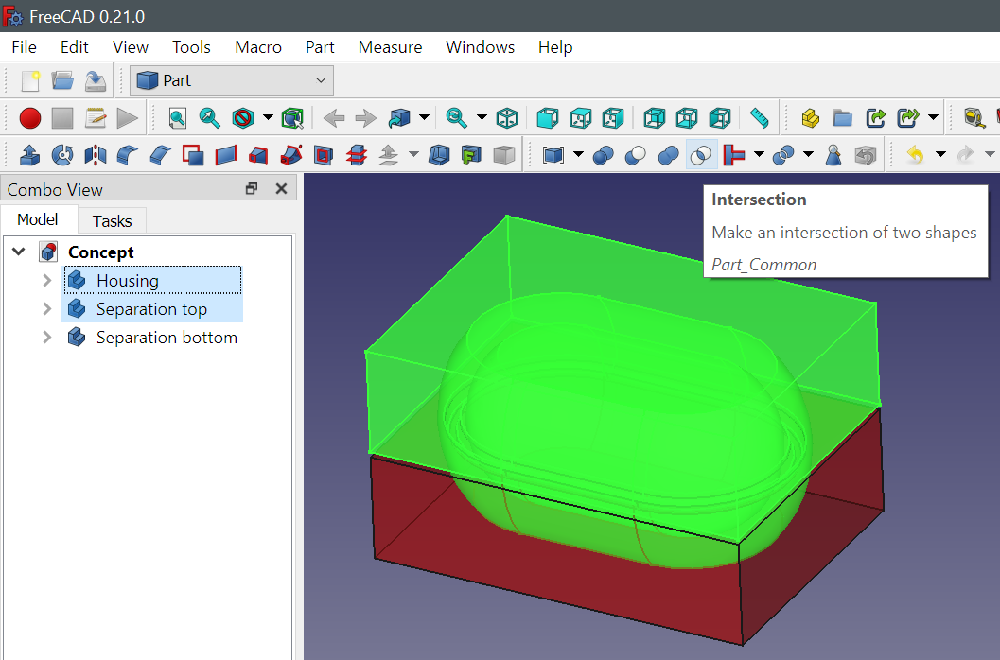
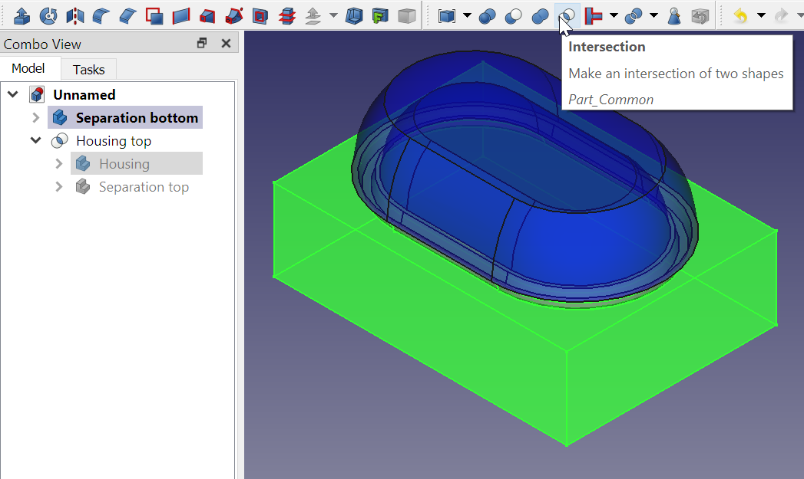

* [Up to "Table of contents"](../Readme.md)
* [link to top](../../tree/main/Readme.md)
* [huh?](/Readme.md)
* [Next to "2 Modifying the Housing Design"](../02-making-modifications/Readme.md)

# 1 Concept of making a housing using boolean operation of bodies

This example demonstrates the concept of constructing a housing through the application of boolean operations on various bodies. The housing will consist of two shells that can be seamlessly assembled together. Follow these steps:

  

**1. Housing Creation**

Begin by forming the **housing body** (1) as a singular body, disregarding any separation concerns for now.

   

**2. Top Separation**

Generate a second body (2) called **Separation top**. This component envelops the volume of the upper section of the housing. In this example, the **Separation top** simply consists of a block and an extruded pipe:

  

**3. Bottom Separation**

Similarly, create another body (3) named **Separation bottom**. This part defines the lower separation boundary.

  

**4. Boolean Operations for Top Housing**

* Switch to the Part workbench
* Select the **Housing** body and the **Separation top** body. 
* Use the <kbd>Intersection</kbd> command from the toolbar to generate a new body, initially named **Common**, which embodies the boolean intersection of the selected bodies. 
* Rename this new body as **Housing top** (1 & 2).

  

**5. Boolean Operations for Bottom Housing**

Although the **Housing** body may appear to have vanished from the model tree, it still exists within the **Housing top** body, as it contributed to its formation. By expanding the **Housing top** body, you'll find the **Housing** body within. To establish the **Bottom housin**g body, select the **Housing** body along with the **Separation bottom** body. Reapply the <kbd>Intersection</kbd> command to these chosen bodies, resulting in a new body named **Common 001**. Rename this resultant body as **Housing bottom** (1 & 3).

  

**6. Modifying colors**

Conclude the process by adjusting the color and transparency attributes of both housing components. 

   

* [Up to "Table of contents"](../README.md)
* [Next to "2 Modifying the Housing Design"](../02-making-modifications/Readme.md)
