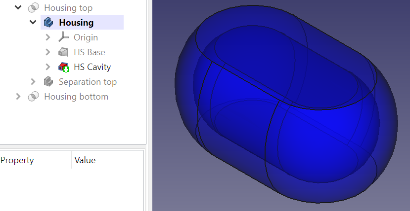
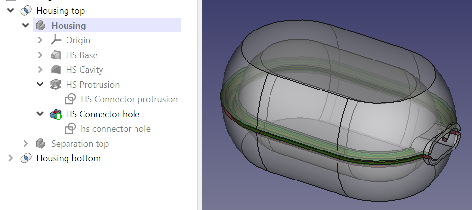

* [Up to "Table of contents"](../Readme.md)
* [Back to "1 Concept of making a housing using boolean operation of bodies"](../01-concept/Readme.md)
* [Next to "3 Maintaining the colors of both housing bodies"](../03-maintaining-colors/Readme.md)

# 2 Modifying the Housing Design

An aspect to consider within this approach is that it is no longer possible to make changes to **Housing top** and **Housing bottom** using the part design workbench. Nonetheless, modifications can still be efficiently executed on the three original bodies. However, it is vital to make the right decision concerning which specific body to target for the modification. This will be demonstrated in the next example, where we will add a feature to accommodate a power cable to the **Housing** body.

**1. Making Housing the active component**

Begin by ensuring that **Housing** is the only visible body and ensure it is the active component by double-clicking it in the Part design workbench.

  

**2. Modifying the housing body**

With the **Housing** body selected, proceed to introduce necessary changes, such as adding a protrusion and a hole to facilitate the integration of a power connector.

  

**3. Reviewing the result**

Following the modification process, by concealing the **Housing** body and making the **Housing bottom** and **Housing top** bodies visible once again, it becomes evident that both these components have undergone alterations as well.

  

This operation overwrites the original colors assigned to the **Housing bottom** and **Housing top** bodies. While it is of course possible to rectify these colors once more, the repetitive nature of this task will soon become annoying. To circumvent this, a simple workaround is proposed.

In [chapter 8](../08-self-tapping-screws/Readme.md), pillars are created for mounting screws. This is good example where modifications are not made to the housing body, but to the bottom and top separation bodies instead.

* [Up to "Table of contents"](../Readme.md)
* [Back to "1 Concept of making a housing using boolean operation of bodies"](../01-concept/Readme.md)
* [Next to "3 Maintaining the colors of both housing bodies"](../03-maintaining-colors/Readme.md)
