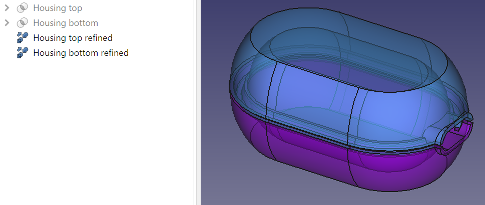
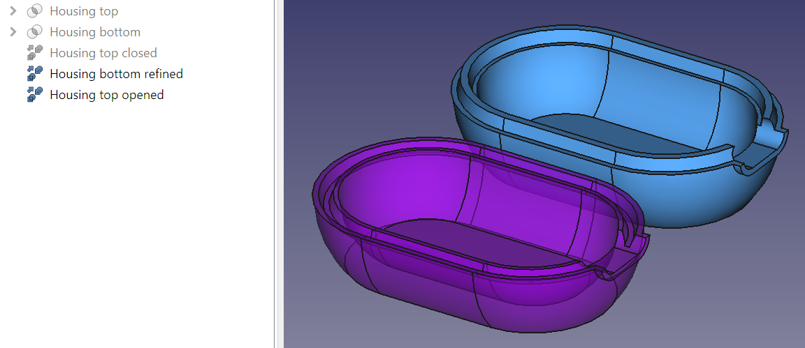

* [Up to "Table of contents"](../Readme.md)
* [Back to "2 Modifying the Housing Design"](../02-making-modifications/Readme.md)
* [Next to "4 Applying a naming convention"](../04-naming-convention/Readme.md)

# 3 Maintaining the colors of both housing bodies

When a body is created as a result of a boolean operation of bodies, colors are overwritten upon each change of these bodies. To circumvent this, a simple workaround is proposed to prevent having to reset the colors after each change.

One of the simplest solutions to maintain the colors of the bodies involves the creation of duplicates of the bodies in question, followed by the application of the desired color to the replicated bodies.

1. Transition to the Part workbench 
2. Select the **Housing top** body. 
3. Choose <kbd>Part</kbd> > <kbd>Create a copy</kbd> > <kbd>Refine shape</kbd> from the menu
4. Rename the duplicated body as **Housing top refined** 
5. Adjust both color and transparency of the copied object

Repeat the process for the **Housing bottom** body.

  

The colors of the refined duplicates will remain unaffected even when modifications are made to the original bodies.

An additional benefit stemming from this workaround is the ability to generate multiple copies, each positioned differently. This grants the convenience of inspecting the components from various angles by selectively rendering specific combinations visible.

  

This workaround comes at a cost. Every boolean operation and copy makes the model more computationally expensive, so when the model tree gets long (see the dependency graph in [Chapter 6](./06-check-model/Readme.md)), recalculation takes progressively longer when changes are made.

* [Up to "Table of contents"](../Readme.md)
* [Back to "2 Modifying the Housing Design"](../02-making-modifications/Readme.md)
* [Next to "4 Applying a naming convention"](../04-naming-convention/Readme.md)
