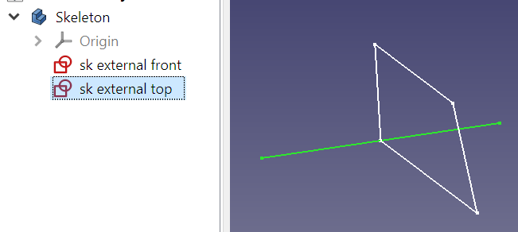
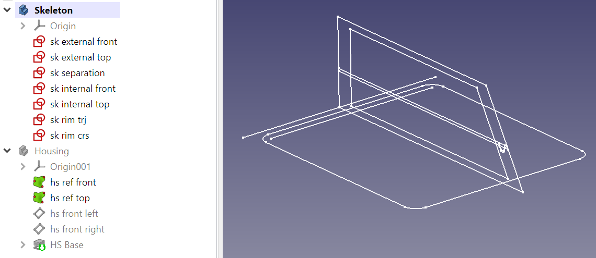
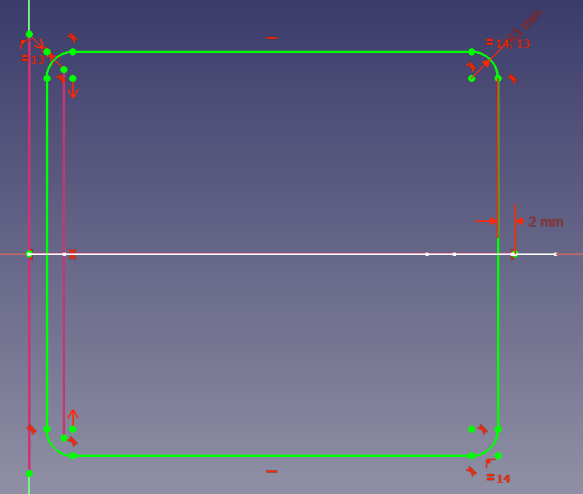
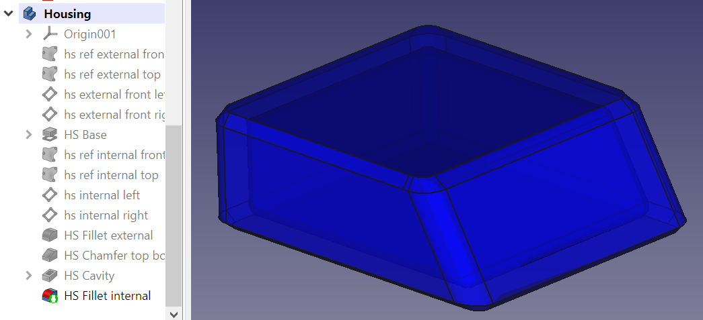
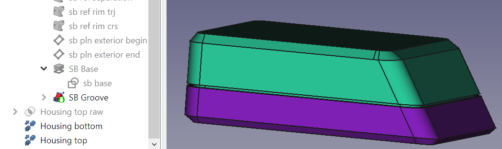
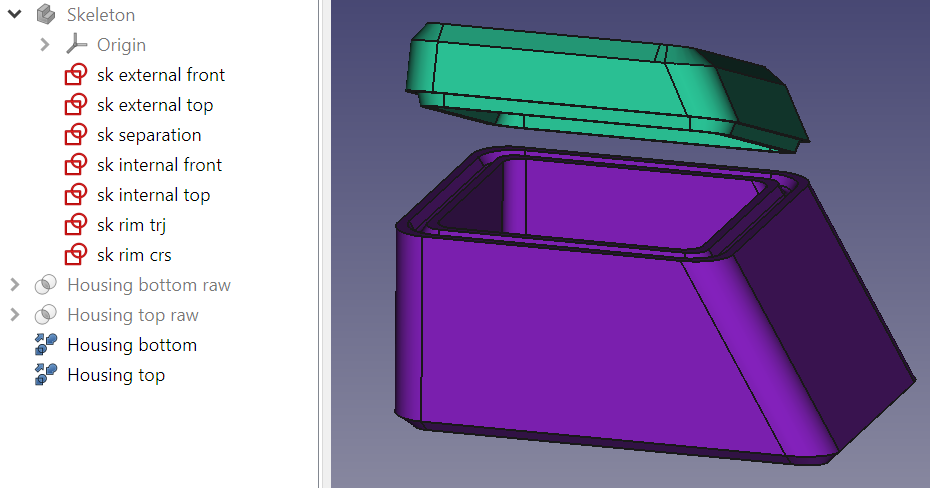

* [Up to "Table of contents"](../Readme.md)
* [Back to "4 Applying a naming convention"](../04-naming-convention/Readme.md)
* [Next to "6 Checking the model"](../06-check-model/Readme.md)

# 5 Using a skeleton to drive dimensions of the bodies

As the number of bodies grows, it becomes increasingly important that the dimensoins of each body are driven by a common model. The concept of a skeleton offers a central entity to manage mechanical interfaces and drive major dimensions.

## First steps

To make the design truly parametric, it is helpful to create links between the different bodies. For instance, the rim is defined in the **Separation top** and **Separation bottom** bodies, but they need to follow the contour that is defined in the **Housing** body. It's crucial to note that the referencing between bodies is one-way; once Body B's features reference Body A, a reciprocal reference from A to B is no longer possible to prevent circular references.

To maintain a structured approach, an effective strategy is to initiate with a **Skeleton** body. This specialized body encapsulates fundamental shapes and dimensions, without volumetric features. Consequently, this **Skeleton** body serves as a reference for other bodies.

A **Skeleton** body also improves robustness of the model. In cases where sketches reference 3D geometry, such as body edges or faces, making minor alterations can trigger instability due to the notorious [Topological Naming Problem](https://wiki.freecad.org/Topological_naming_problem). To circumvent this, sketches should refer to other sketches, rendering them less prone to naming changes. A separate **Skeleton** body allows to make multiple simple sketches, which are preferable over complex ones.

When we use tools such as a pad or a pocket to extrude geometry, the depth of extrusion is usually a fixed number. To make the design fully driven by sketches from the **Skeleton** part, we choose a different approach.

Here's how it works:

1. Create a sketch in the **Skeleton** part, which contains an edge with an endpoint in the plane where the extrude begins and another where the extrude stops. Also create a sketch which can be referred to for the shape.

  

2. Also create a body named **Housing**
   
3. Create a copy of the sketches we need using a Shape Binder

  

4. Create two datum planes: one at the beginning of the extrude, named **hs pln external front left**  and another at the end, named **hs pln external front right**. To define these planes, use an edge and a point and define the datum plane <kbd>Normal to edge</kbd>:

  

5. Ensure that the **Skeleton** body is invisible, to avoid referring to sketches in this body. 
  
6. Create a sketch **hs base** on the first plane. The geometry in the sketch can refer to a Shape binder derived from the **Skeleton** part using the <kbd>Create external geometry</kbd>  button in the sketcher

  

**Note:** The 'front side' of the datum plane, on which a sketch is created, is sometimes counter-intuitive, so it seems as if you need to draw a mirrorred sketch. To solve this, set the <kbd>Map reversed</kbd> property of the datum plane to <kbd>true</kbd>. It is best to do this early on in the process, since it often corrupts the sketch.

7. Extrude the up until the other datum plane using the <kbd>Up to face</kbd> option. When using the <kbd>Select face</kbd> button, the plane can also be selected in the model tree.

  

The method proposed here requires more effort. It wil prove it's benefits when modifications are necessary lateron in the process.

## Finalization

Next, we take some bigger steps to complete the housing. We add a number of sketches to the **Skeleton** body:
* **sk separation**: the separation lines for both the top and the bottom separations
* **sk internal front**: the front view of the cavity inside housing
* **sk internal top**: the top view of the cavity inside housing
* **sk rim trj**: the trajectory that the rim and the groove must follow
* **sk rim crs**: the cross sections of both the rim and the groove

  

Note that a sketch can make references to sketches in other planes. For instance, the right edge of **sk rim trj** references a line in the **sk separation** sketch:

  

To make such references, switch to ISO view:

  

The finish the **Housing** body:

  

Note that chamfers and fillets were added, but they are just defined in the **Housing** body, without references to the **Skeleton** body.

The **Separation bottom** body also has a few necessary shape binders referencing the **Skeleton** body:

  

This is wat **Separation bottom** looks like when it is completed:

  

**Separation top** is very similar:

  

The final result looks like this:

  

And with the top off:

  

Note that:
* the main outer dimensions of the housing can be changed by only changing dimensions in the **Skeleton** body
* not all sketches from the **Skeleton** body have been imported, e.g. the rim is not needed in the **Housing** body 
* details which are independent from other bodies (such as the chamfer), were only defined in the **Housing** body

The proof of the pudding is in the eating. We change a few dimensions in the **Skeleton** body to see if the model is indeed parametric. The result is as expected:

  

  

* [Up to "Table of contents"](../Readme.md)
* [Back to "4 Applying a naming convention"](../04-naming-convention/Readme.md)
* [Next to "6 Checking the model"](../06-check-model/Readme.md)
