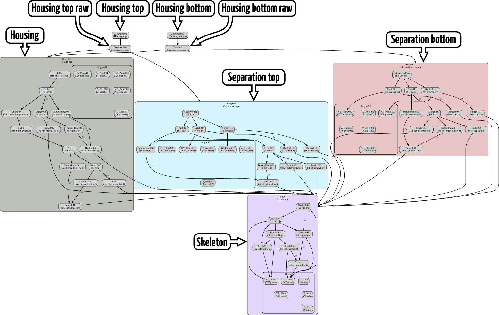
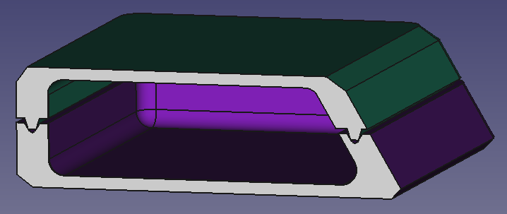
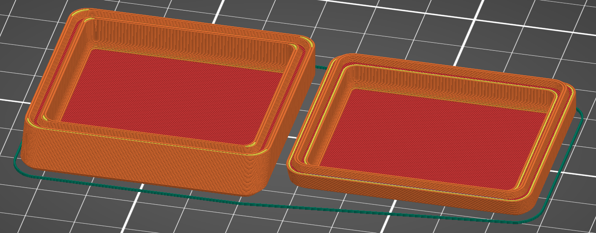

* [Up to "Table of contents"](../Readme.md)
* [Back to "5 Using a skeleton to drive dimensions of the bodies"](../05-skeleton-body/Readme.md)
* [Next to "7 Creating references to the internal components of the housing"](../07-referencing-components/Readme.md)

# 6 Checking the model

## Using the Check geometry tool

The Check geometry tool from the part workbench can be used to check if the 3D model is valid (Part workbench > Part > Check geometry ). It is beyond the scope of this tutorial to explain how to solve common problems. MangoJelly has an [excellent video](https://www.youtube.com/watch?v=bw1Y5mrHrWY) on this tool. If causes are hard to find, the FreeCAD community is also willing to help.

## Dependency graph

Sometimes links between bodies cause errors that are very hard to find. Sometimes the problem is that there are crosslinks between bodies, i.e. body A refers to body B and body B refers back to body A. This circular reference causes FreeCAD to stop automatic recalculation of the part.

The dependency graph (menu <kbd>Tools</kbd> > <kbd>Dependency Graph</kbd>) can be very helpful to spot those errors. To use this tool, the third party software [Graphviz](https://graphviz.org/) must be installed (see [https://wiki.freecad.org/Std_DependencyGraph](https://wiki.freecad.org/Std_DependencyGraph)).

The dependency graph of the housing looks like this (text balloons were added manually to improve readability):

The graph shows that:
* All bodies directly or indirectly refer to the **Skeleton** body 
* Body **Housing top raw** refers to **Separation top** and **Housing**
* References made by the **Part workbench** act on bodies, while references made by the **Part design workbench** act on features
* None of the arrows are red, indicating there are no errors in this graph

* [Up to "Table of contents"](../Readme.md)
* [Back to "Using a skeleton to drive dimensions of the bodies"](./05-skeleton-body/Readme.md)
* [Next to "Creating references to the internal components of the housing"](./07-referencing-components/Readme.md)

## Interference check

Although FreeCAD lacks a mechanical interference check function, it is easy to perform an interference check on two bodies. Simply select both bodies and execute the <kbd>Intersection</kbd> command from the part workbench. If the result is a body without volume, apparently there is no interference.

## Persistent section cut

Using the persistent section cut (View > Persistent section cut) interfaces can be visually inspected in detail:

  

This tool was significantly improved in FreeCAD 0.21.

## Checking the result in the slicer

I'm using this technique often for 3D printing projects. One of the lessons I learned the hard way is that it is important to regularly check if the parts are printable.

Things to specifically pay attention to:
- are all details still large enough to print?
- would a different orientation of the separation plane make printing easier?
- is it possible to avoid support structures easily?
- is it possible to reduce print time by making other design choices?

  

As can be seen in this screenshot, both the top of the rim and the sides of the groove are printable with multiple adjacent tracks.

* [Up to "Table of contents"](../Readme.md)
* [Back to "5 Using a skeleton to drive dimensions of the bodies"](../05-skeleton-body/Readme.md)
* [Next to "7 Creating references to the internal components of the housing"](../07-referencing-components/Readme.md)
