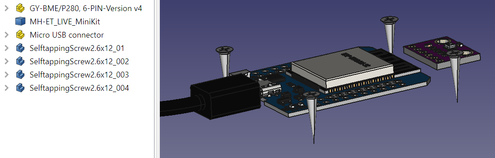
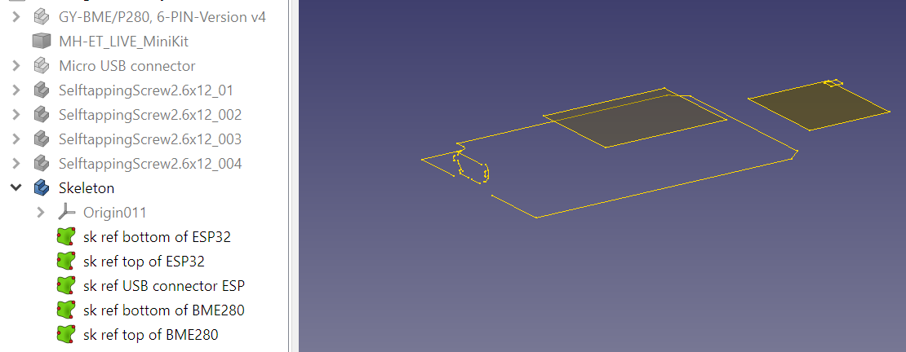
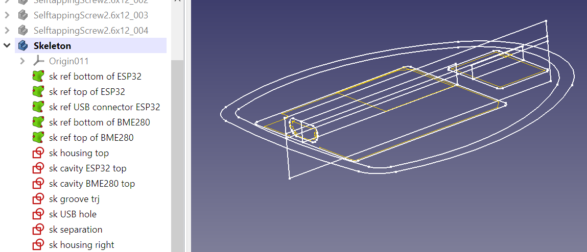
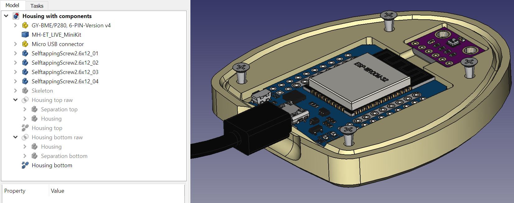
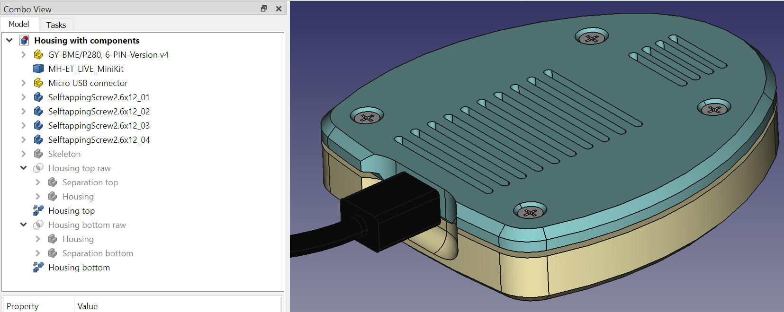

* [Up to "Table of contents"](../Readme.md)
* [Back to "6 Checking the model"](../06-check-model/Readme.md)
* [Next to "8 Using self tapping screws"](../08-self-tapping-screws/Readme.md)

# 7 Creating references to the internal components of the housing

In the next example, we will build a housing for an internet of things application. The device will contain a thermometer/barometer/hygrometer connected to a microcontroller. The microcontroller can record the environmental conditions and report logged data over a wireless link.

For projects like this, it is important to obtain accurate 3D models. Usually they are available as STEP file or in another format which can be imported in FreeCAD. If not, you need to create them yourself. If this is the case, ensure you take enough headroom for tolerances.

**1. Import the components in the FreeCAD file**

I usually use <kbd>File</kbd> > <kbd>Merge project</kbd>.

Orient the components well relative to each other. 

If you can use symmetry in your design, it also make sense to orient the components relative to the coordinate system, but for more flexibility you can also create planes for that in the **Skeleton** body in the next step.

  

**2. Create the Skeleton body**

In the skeleton, import important geometry of the components using shape binders. Do this by selecting the important edges and clicking the green <kbd>Shape binder</kbd> button. This way, the sketches in the skeleton will dynamically follow the components when components are moved.

  

**3. Create the sketches in the Skeleton body**

  

**4. Create the other bodies**

Create the **Housing**, **Separation top**, **Separation bottom**, **Housing top** and **Housing bottom** like in the previous example.

  

  

We can now move the boards around, and (within certain constraints), the cavities in the housing will follow the components.

* [Up to "Table of contents"](../Readme.md)
* [Back to "6 Checking the model"](../06-check-model/Readme.md)
* [Next to "8 Using self tapping screws"](../08-self-tapping-screws/Readme.md)
