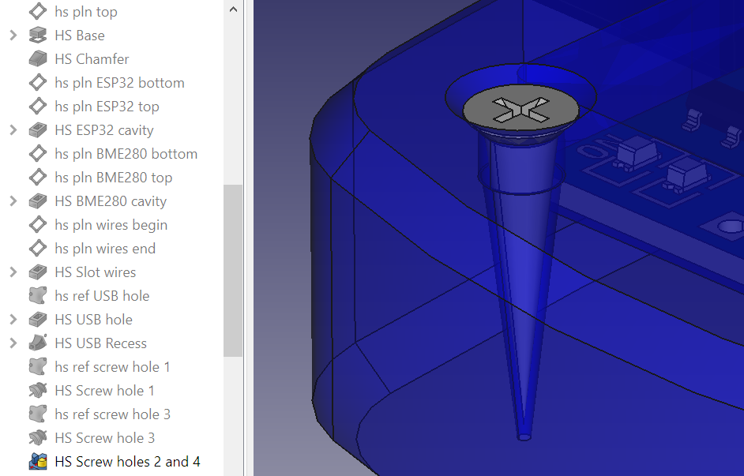
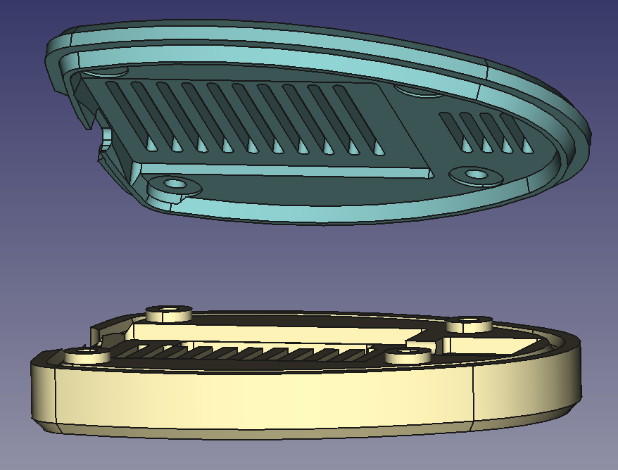

* [Up to "Table of contents"](../README.md)
* [Back to "7 Creating references to the internal components of the housing"](../07-referencing-components/Readme.md)
* [Next to "9 Creating a complex hinge"](../09-hinge/Readme.md)

# 8 Using self tapping screws

I often use self tapping screws for such housings. With the right tolerances, these screws work really well and require no post processing (tapping, inserts) in the parts, which makes it quite fast. These screws are available from many different suppliers at AliExpress.

  

To make the screw holes parametric, I created a model of the screw which contains an additional sketch representing the hole in the housing.

  

Below the head of the screw, the sketch has a cylindrical section which is intended to end up in the part that needs to be fixed, and a conical part in which the thread will be formed.

  

  

## Creating a screw hole
This is how it works:

1. Insert screw in the model using <kbd>File</kbd> > <kbd>Merge project</kbd> and orient it using <kbd>Transform</kbd> under the right mouse button
 
2. Create a shape binder **hs ref screw hole 1** in the **Housing** body, referencing the screw hole sketch from the model of the screw

3. Make the sketch in the original model invisible (so we can only select elements from the shape binder)

4. Select the center line of the shape binder, and create a datum axis through it, named **hs axs screw hole 1**

  

5. Use the groove command on **hs ref screw hole 1** to create thre screw hole, using **hs axs screw hole 1** as a centerline. Rename the groove **HS Screw hole 1**

  

Now if we move or rotate the screw, the hole will move with it.

## Creating a pillar for the screw
Sometimes the separation of the housing does not line up with the separation in the screw hole model. For instance, In the housing model I lined up the separation in the middle of the USB port, so the housing can be closed easily. 

To solve this, we can make a local pillar in the bottom housing and a hole in the top housing.

  

1. Create a shape binder **sk ref screw hole 1** in the **Skeleton** body, referencing the screw hole of the first screw.
2. Make the model of the original screw invisible 
3. Select **sk ref screw hole 1** as a plane to draw the sketch of the screw pillar on
4. Create sketch **sk screw pillar 1** that represents both the pillar in the **Bottom housing** and the hole in the **Top housing**. The top of the pillar must align with the separation plane in the screw hole, the bottom of the pillar is aligned with the lower line of the separation. Ensure the centerline of the pillar/hole is also a geometry line. We want to refer to it lateron.

  

5. Make **Separation bottom** the active body
6. Create a shape binder for the sketch **hole profile** of screw 1 and rename it **sb ref screw hole 1**
7. Create a shape binder for **sk screw pillar 1** from the **Skeleton** body and rename it **sb ref screw pillar 1**
8. Use **sb ref screw hole 1** as a plane for a sketch **sb screw pillar 1** to create the pillar. Add a geometry line that will be the center line of the pillar

  

1.  Create a revolution and name it **SB Screw pillar 1** 
2.  Repeat the same procedure for the other pillars. In this case, I did pillar 3 in the same way and created pillars 2 and 4 by mirroring.

  

Repeat the procedure to create the holes in **Separation top**.

  

The changes will now automatically come through in both housing parts:

  

This is a good example to demonstrate why some changes need modifications in the housing part, while others require changes in the separation parts.

* [Up to "Table of contents"](../README.md)
* [Back to "7 Creating references to the internal components of the housing"](../07-referencing-components/Readme.md)
* [Next to "9 Creating a complex hinge"](../09-hinge/Readme.md)
