* [Up to "Table of contents"](../README.md)
* [Back to "8 Using self tapping screws"](../08-self-tapping-screws/Readme.md)
* [Next to "10 Referencing external parts"](../10-referencing-external-parts/Readme.md)

# 9 Creating a complex hinge

The next project regards a housing with a hinge. It can for instance be used for pencils or glasses. There is a magnet in each shell to lock the housing. An advantage of 3D printing is that we can pause printing at a designated layer to insert the magnets manually. When completed, the magnets are fully enveloped by the printed part.

This is the front view of the case when it is closed:

  

This is the front view of the case when it is open:

  

The details of the hinge are quite complex:

  

The flat edges in the rear view are needed to avoid mechanical interference when the case is fully open, and they act as an end stop.

This is a cross section through the middle of the casing when it is closed:

  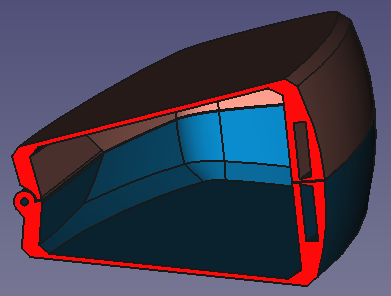

This is a cross section through the middle of the casing when it is open:

  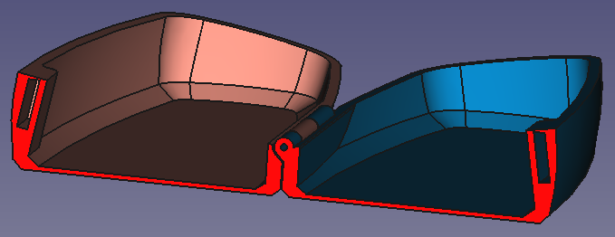

The orientation of the parts during printing is the same as when the case is open. To bridge the openings of the magnets well, the top of the magnet opening needs to be horizontal during printing. This is why the magnet opening is not rectangular.

Four sketches define the general shape of the housing, for the top view and the right view, and for the internal and the external shape:

  

Two sketches define the hinge:

  

For the design of a 3D printed hinge it is important to take into account the accuracy of printing. There needs to be a slit of about 0.3 mm between the parts in all directions.

**sk hinge right** defines the right view of the hinge. The smallest (ø1.4 mm) circle represents the hole for the hinge pin. The circle around that represents the cylindrical shape of the hinge (which has a wall thickness of 1.35 mm). The outermost circle is a reference for the play (0.3 mm) between both parts of the housing.

  

The 135° angle is chosen to ensure both housing shells are printable without support structures.

The line going down is perpendicular to the bottom flat side of the housing. This line is a reference for the flat face mentioned above, ensuring the housing can be opened fully flat without mechanical interference.

There is also geometry representing the round parts of the hinge, **sk hinge top** basically divides the length of the hinge in three types of sections:
* elements that are connected to the bottom part of the housing
* elements that are connected to the top part of the housing
* space between the parts (S)

The sketch contains only two dimensions: the total length of the hinge and the space between the parts in axial direction. The radius of the cylinders is also modelled, but this has been derived from **sk hinge right**

  

The housing is modelled in two different bodies: **Housing external** represents the outside of the housing, **Housing internal** represents the cavity inside. The final housing is obtained by boolean subtraction in the part workbench.

## Housing external

The relevant sketches from the skeleton are imported as shape binders. The bottom and top datum plane are defined as 'normal to edge', referencing the Z-axis and the bottom  and top most points. The contour **he base** is modelled on **he pln bottom** and extruded until **he pln top**.

  

**he chop off top** chops off the oblique surfaces of **HE Base**.

  

A curve along the outside is made with a subtractive pipe using **he trim outside** along **he base**:

  

Chamfers are added, **he ref hinge right** is imported and the flat edges for the end stop when opening the case are created:

  

**he ref hinge top** is imported as shape binder, and the beginning- and end datum planes for the hinge are created. They exclude the space next to the hinge:

  

The cross section of the hinge **he hinge** is created on **he pln hinge left**, referring to **he ref hinge right** for the shape:

  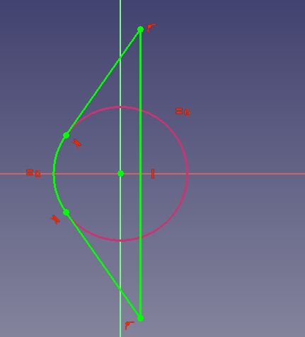

**he hinge** is extruded from **he pln hinge left** to **he pln hinge right**, forming **HE Hinge**:

  

As a final step for the hinge, the hole through the hinge is created:

  

Both sketches determining the magnet pockets are imported, two planes defining the beginning and end of the magnet pockets are created, the lower magnet pocket is created, and the upper magnet pocket is mirrored from the bottom one:

  

## Housing internal

The first steps of the Housing internal body are basically the same, but now referring to **sk housing internal top** and **sk housing internal right** instead of **sk housing external top** and **sk housing external right**:

  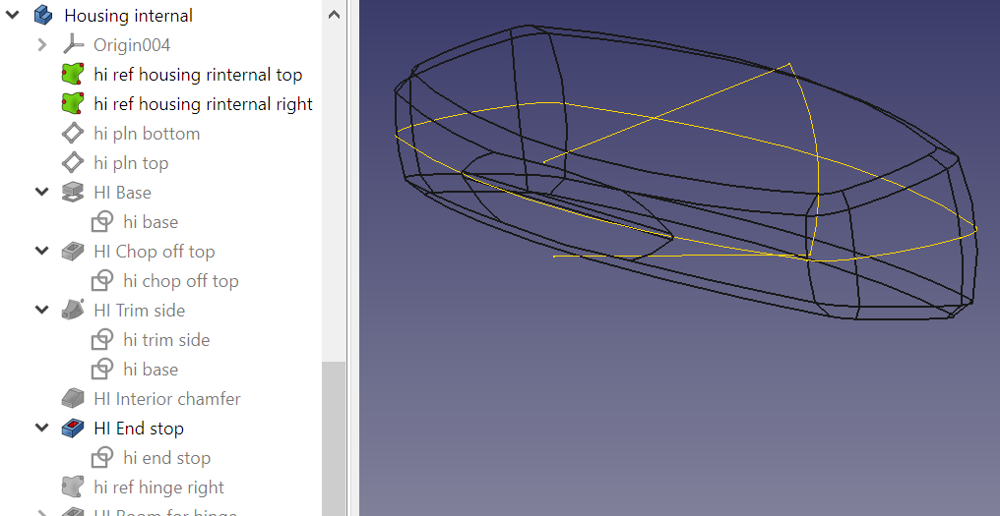

**hi ref magnet cavity top** is imported as shape binder. A rounded rectangle is sketched with a wall thickness around this shape in **hi room for magnets**. This is extruded from the shape in both directions as **HI Room for magnets**:

  

Finally, a fillet is added to the magnet bump:

  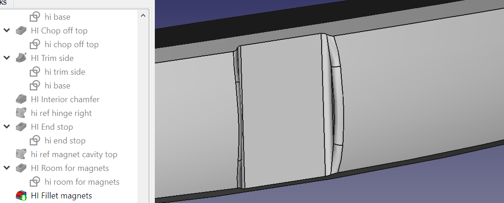

## Housing

The housing is created by boolean subtraction of **Housing external** and **Housing internal** in the Part workbench:

  

## Separation bottom

The **Separation bottom** body starts with importing **sb ref housing external top** and **sb ref housing external right**, and then construction only **sb pln bottom**. A rectangle is drawn in a plane 0.1 mm below the XY plane, to ensure there is 0.2 mm space between both shells when the housing is closed, allowing for tolerances of 3D printing. The rectangle is 3 mm larger than the outer shape.

  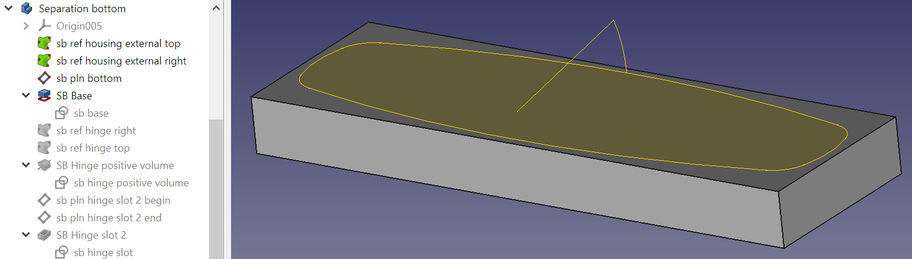

**sb ref hinge right** and **sb ref hinge top** are imported as shape binders. A positive revolve **SB Hinge positive volume** is added to the shape. The sketch **sb hinge positive volume** is a direct trace from **sb ref hinge top**.

  

  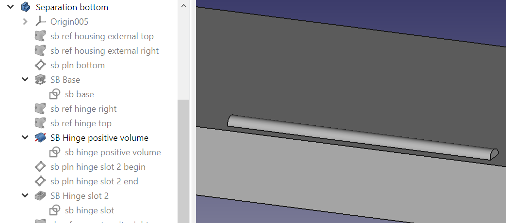

Next we will create the slot for protrusion 2 from the top housing.

  

Two datum planes are created, **sb pln hinge slot 2 begin** and **sb pln hinge slot 2 end**, which will be used for the second slot. They will include the space next to the slot.

  

Line B of sketch **sb hinge slot** on datum plane **sb pln hinge slot 2 begin** is under an angle of 160° relative to line A of **sb ref hinge right**. This is because the top housing can be opened 160°, ensuring sufficient space between both parts. The larger circle in **sb ref hinge right** is used, to provide space radially.

  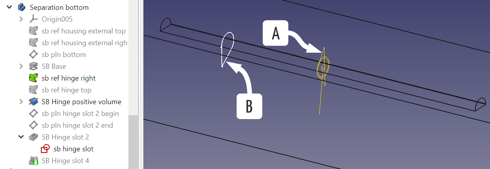

**SB Hinge slot 2** is extruded until **sb pln hinge slot 2 end**:

  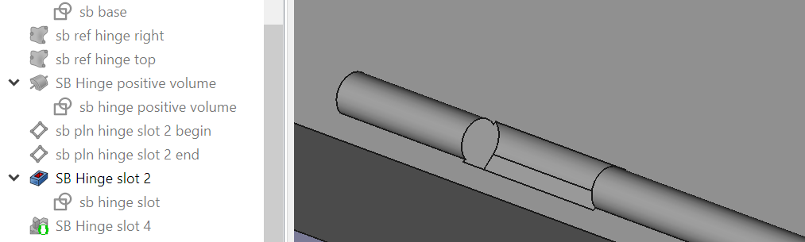

**SB Hinge slot 4** is created by mirroring **SB Hinge slot 2** over the YZ plane.

  

## Housing bottom

**Housing bottom** is a boolean intersection of **Housing** and **Separation bottom**

  

## Separation top

**Separation top** is very similar to **Separation bottom**, only now the slots are in locations 1, 3 and 5. 

  

Slots 1 and 3 were created individually, slot 5 is a mirror of slot 1.

  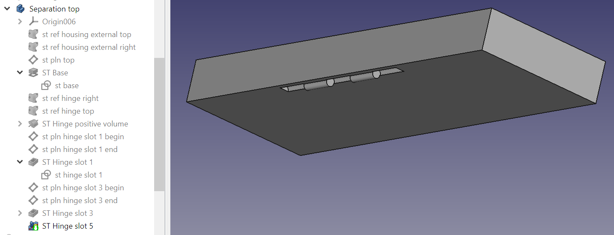

## Housing top

**Housing top** is a boolean intersection of **Housing** and **Separation top**

  

## Final checks

The **Dependency graph** and **Check geometry tool** that as described earlier reported no errors.

The **Persistent section cut** also reveals no problems:

  

The **Printability inspection** also looks good:

  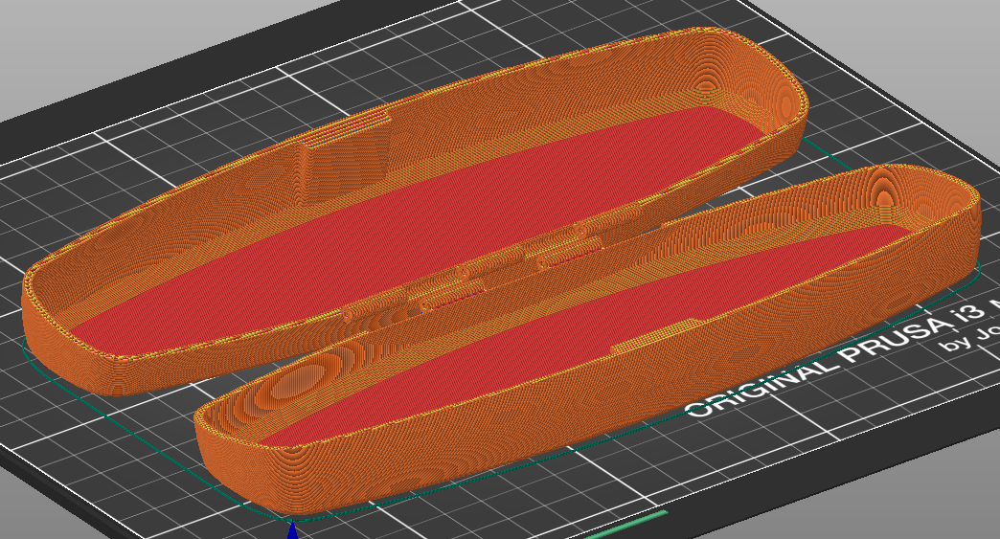

* [Up to "Table of contents"](../README.md)
* [Back to "8 Using self tapping screws"](../08-self-tapping-screws/Readme.md)
* [Next to "10 Referencing external parts"](../10-referencing-external-parts/Readme.md)

