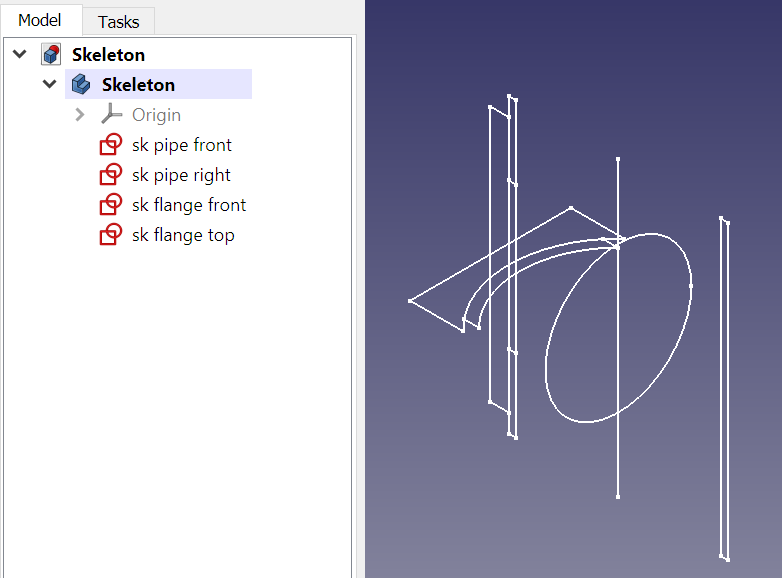
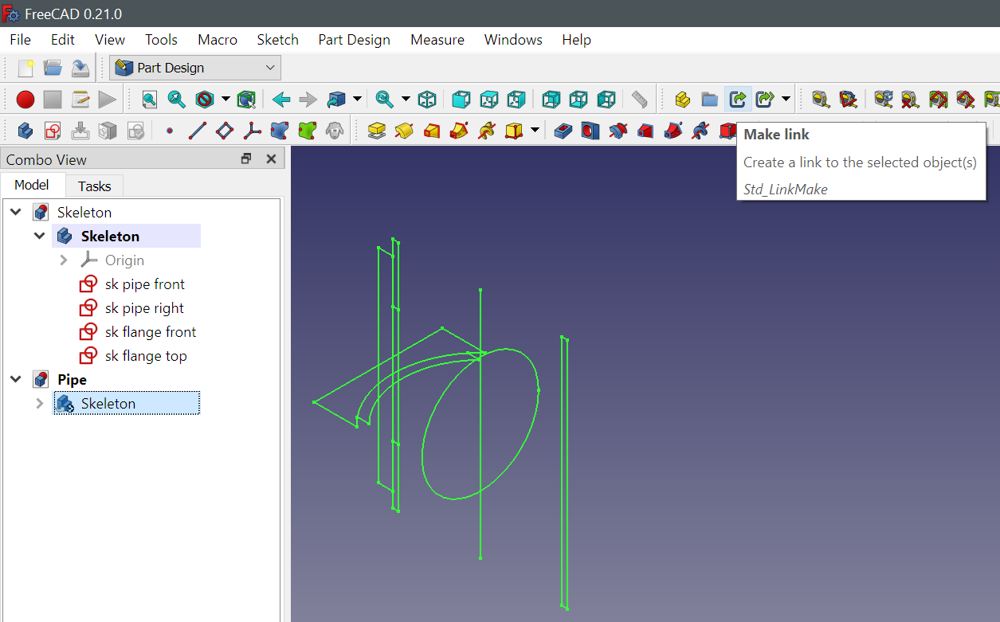
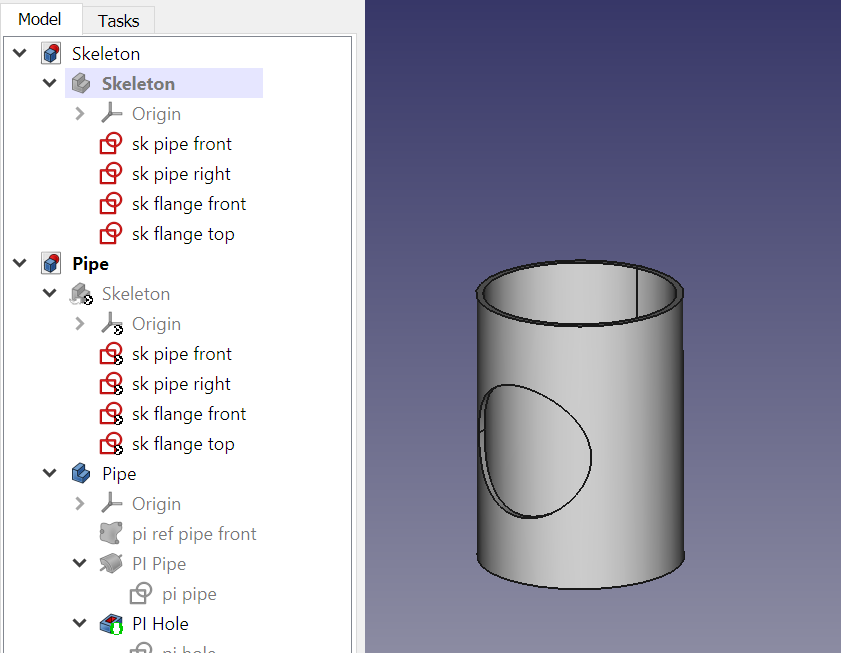
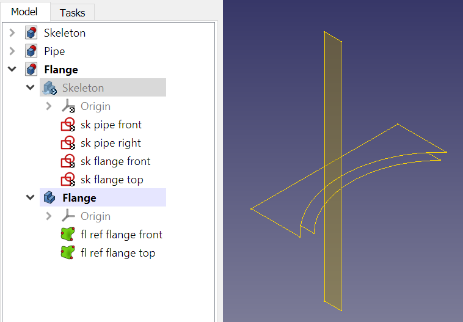
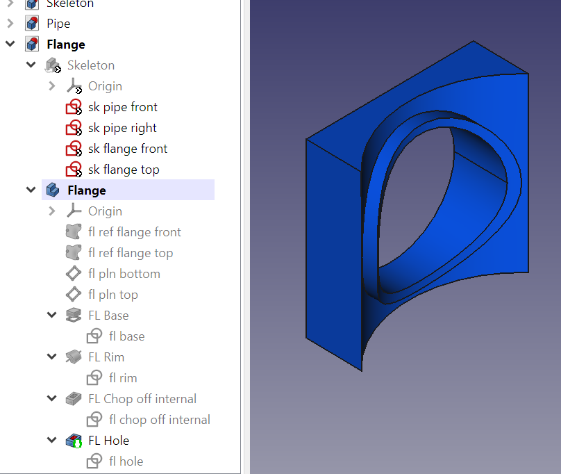
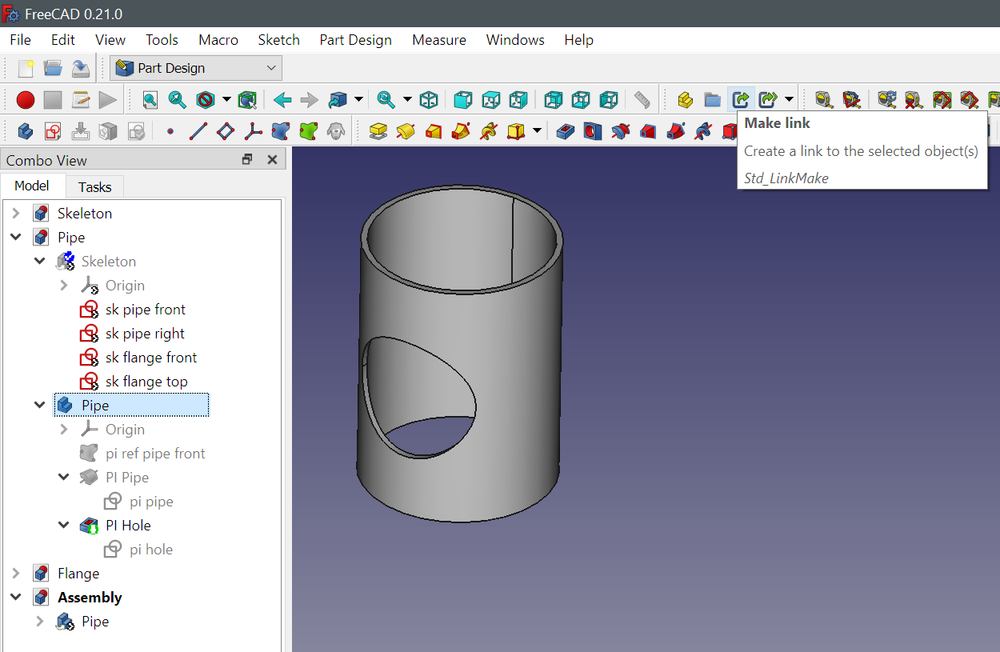
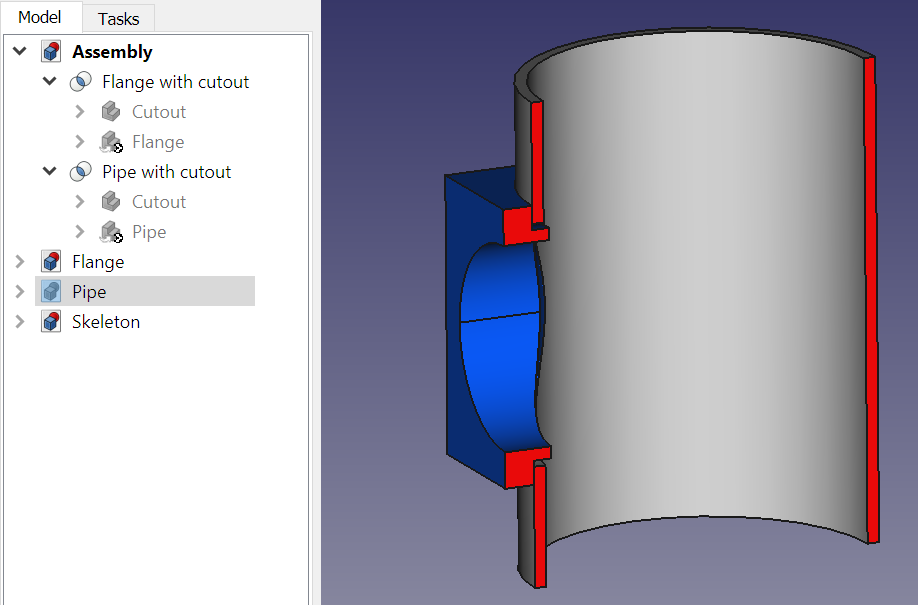

* [Up to "Table of contents"](../Readme.md)
* [Back to "9 Creating a complex hinge"](../09-hinge/Readme.md)

# 10 Referencing external parts

When projects become more complex, including many different parts, it may be useful to reduce the number of bodies per FreeCAD file.

Assembly workbenches tend to be prone to the Topological Naming problem: assemblies tend to fall apart if minor changes are made to individual parts.

If assemblies are static (no moving parts), it is possible to use the same global coordinate system for all parts. This means that upon importing parts in the general assembly, no orientation is needed, except for parts that occur more than once.

This is how it works:

1. Create the **Skeleton** body as usual, 
2. Add sketches that form important envelopes or mechanical interfaces between the parts.
3. Save the model as a file named **Skeleton**

  

4. Create a second file, named **Pipe**, and save that too. It is important that the part is saved to become a recipient for a link.

5. Shape binders cannot directly link to elements in other files. Therefore, we need to first import **Skeleton** via a dynamic link. While the **Pipe** part is open, select the **Skeleton** body in the model tree and choose the <kbd>Make link</kbd> button in the toolbar.

  

6. Create a new body named **Pipe**.

7. Create the required Shape binders and create the sketches and volumes like in previous examples.

  

8. Create a third file, named **Flange**

9. Select the **Skeleton** body in the model tree and choose the <kbd>Make link</kbd> button.

10. Create a new body in the **Flange** part, named **Flange**

11. Create the required Shape binders and create the sketches and volumes like in previous examples.

  

12. Create the model of the flange

  

13. Create a fourth file named **Assembly**

14. Select the **Pipe** body in the model tree and choose <kbd>Make link</kbd>

  

15. Select the **Flange** body in the model tree and choose <kbd>Make link</kbd>

  

Since both parts have been created in the same coordinate system, they are already in the right location and orientation.

The skeleton still drives the major dimensions and interfaces in all parts of the assembly.

* [Up to "Table of contents"](../Readme.md)
* [Back to "9 Creating a complex hinge"](../09-hinge/Readme.md)
