# Introduction
This tutorial demonstrates how to design 3D printable housings in FreeCAD. The advantage of this approach is that it is quite structured, and you can manage changes in the design quite well, even if the design gets complex.

To follow this tutorial, you need to be familiar with the part design workbench and the sketcher. I’ll try to just focus on a high conceptual level.

# Topics in this document
- [Introduction](#introduction)
- [Topics in this document](#topics-in-this-document)
- [Concept of making a housing using boolean operation of bodies](#concept-of-making-a-housing-using-boolean-operation-of-bodies)
- [Making changes to the housing](#making-changes-to-the-housing)
- [Maintaining the colors of both housing bodies](#maintaining-the-colors-of-both-housing-bodies)
- [Applying a naming convention for bodies and features](#applying-a-naming-convention-for-bodies-and-features)
- [Using a skeleton to drive dimensions of the bodies](#using-a-skeleton-to-drive-dimensions-of-the-bodies)
- [Checking the model](#checking-the-model)
  - [Using the Check geometry tool](#using-the-check-geometry-tool)
  - [Checking links](#checking-links)
  - [Checking the result in the slicer](#checking-the-result-in-the-slicer)
- [Creating references to the internal components of the housing](#creating-references-to-the-internal-components-of-the-housing)
- [Using self tapping screws to close the housing](#using-self-tapping-screws-to-close-the-housing)
  - [Creating a screw hole](#creating-a-screw-hole)
  - [Creating a pillar for the screw](#creating-a-pillar-for-the-screw)
- [Creating a complex hinge](#creating-a-complex-hinge)
  - [Housing external](#housing-external)
  - [Housing internal](#housing-internal)
  - [Housing](#housing)
  - [Separation bottom](#separation-bottom)
  - [Housing bottom](#housing-bottom)
  - [Separation top](#separation-top)
  - [Housing top](#housing-top)
  - [Final checks](#final-checks)
- [Referencing external parts](#referencing-external-parts)

# Concept of making a housing using boolean operation of bodies
I this example, we want to create a housing which consists of two shells which can be assembled together:
1. Create the housing (1) as a single body, without worrying about the separation.
2. Create a second body (2) separation top, which covers which part of the housing will become the top half of the housing
3. Create a bottom separation (3) as a third body in the same way
4. Create the top housing as a boolean operation between the housing and the top separation
5. Create the bottom housing as a boolean operation between the housing and the bottom separation

Create the first body named **Housing** (1). In this example it consists of an additive loft for the outside and a subtractive loft for the internal cavity.

  

Then create another body in the same part, and call it **Separation top** (2). In this example, it consists of a pad and an additive pipe to create the rim. Note that the pad is deliberately larger than the housing: since we will create a boolean operation lateron, the exact size does not matter.

  

Also create **Separation bottom** (3) as a separate body.

  

Next move to the part workbench. Select **Housing** and **Separation top**, and choose the `Intersection` command from the toolbar.

  

Thus a new body named **Common** is created, consisting of the boolean intersection of both selected bodies. Rename that body **Housing top** (1 & 2).

It may seem as if the **Housing** body has disappeared from the model tree, so we can no longer select it to create the bottom housing. However, if we expand the **Housing top** body, we can see that **Housing** is still there since it was used to make up the **Housing top**. Select the **Housing** body and the **Separation bottom** body and apply the `Intersection` command again on those two bodies. The resulting body is named **Common 001**. Rename it to **Housing bottom** (1 & 3).

  

After modifying the color and transparency of both housing parts, the result looks like this:

  

# Making changes to the housing

One could argue that the drawback of this method is that we can no longer modify both **Housing top** and **Housing bottom** using the part design workbench. In practice this is not a problem, since we can make those modifications to the three bodies we started with. However, it is important to make a considerate decision about on which body to make the modification. For instance, if the housing is used to support some electronics, and we need a power cable to connect to the electronics inside, we can simply add those features to the original **Housing** body.

Ensure that **Housing** is the only visible body, and that it is the active part by doubleclicking it.

  

Next, add a protrusion and a hole to the housing for the power connector.

  

After making the **Housing** body invisible and the **Housing bottom** and **Housing top** bodies visible, we can see that both bodies were modified:

  

Please note that this operation has overwritten the colors of the **Housing bottom** and **Housing top** bodies. We can again correct these colors, but this soon becomes annoying and so we apply a simple workaround to avoid that.

# Maintaining the colors of both housing bodies

The simplest workaround is to create a copy of the bodies and apply the desired color to this copy.

Switch to the **Part workbench** and select the **Housing top** body.

  

Rename the copied body **Housing top refined** and modify color and transparency. Repeat this for **Housing bottom**.

  

The colors of the refined shapes will remain unchanged if the original bodies are modified.

Another advantage of this workaround is that we can create multiple copies in various positions. This way we can easily inspect the parts in different orientations by making the right combination visible.

  

# Applying a naming convention for bodies and features

If the number of bodies and features in the model tree grows, it becomes increasingly difficult to indentify the right feature if you want to make changes. It becomes helpful to choose unique and meaningful names for features. I have developed my own system which is as follows:

| Type of feature         | Case          | Code              |
|-------------------------|---------------|-------------------|
| Volumetric features     | Sentence case | `Bd Name`         |
| Non-volumetric features | lowercase     | `bd typ name ext` | 

Non-volumetric features such as sketches and planes use lower case names. Volumes use Sentence case names (e.g., a sketch may be named **hs base**, and the pad that is created using that sketch is named **HS Base**)

| Code   | Meaning                                                                                                              |
|:------:|----------------------------------------------------------------------------------------------------------------------|
| `Bd`   | a loose abbreviation of the body (**HS** for housing, **ST** for separation top, **SB** for separation bottom, etc.) |
| `Typ`  | a 3 letter code for the type of feature after that abreviation:   **pln** for a plane   **axs** for an axis   **ref** for a shape binder |
| `Name` | The name of the feature |
| `ext`  | for additive and subtractive pipes:   the trajectory of the pipe is followed by **trj**   the cross section is followed by **crs** |

Examples:

| Name of the feature | Purpose                                                                                             |
|---------------------|-----------------------------------------------------------------------------------------------------|
| `sk top`            | Top view of the part in the **Skeleton** body                                                       |
| `hs ref top`        | Shape binder in the housing body, referencing the top view in the **Skeleton** body                 |
| `hs pln bottom`     | Datum plane in the housing body, representing the bottom of the **Housing** body                    |
| `sb groove crs`     | Cross section of the groove in the **Separation bottom** body                                       |
| `sb groove trj`     | Trajectory of the groove in the **Separation bottom** body                                          |
| `SB Groove`         | The 3D groove in the **Separation bottom** body, made up of **sb groove crs** and **sb groove trj** |

It is helpful to choose a pragmatic approach: for simple projects, the overhead of renaming every feature may not be worth the effort.

# Using a skeleton to drive dimensions of the bodies

As can be seen in this example, it would be helpful to create links between the different bodies to make the design truly parametric. For instance, the rim is defined in the **Separation top** and **Separation bottom** bodies, but they need to follow the contour that is defined in the **Housing** body. One body can reference another body, but the reference can only be in one direction: once features of a body B are referencing body A, there can no longer be a reference from body A to body B.

One way of keeping this structured is to start with a **Skeleton** body which only holds some basic shapes and dimensions, but that does not represent any volumes. This **Skeleton** body is then referenced by the other bodies.

Another advantage of a skeleton body is that it makes the model more robust. If sketches refer to 3D geometry, such as edges of the body, the model quickly becomes unstable since names of those edges are changed when making small changes (the notorious [Topological Naming Problem](https://wiki.freecad.org/Topological_naming_problem) ). When referring to edges in sketches instead, it is less likely that names of those edges are changed. This is especially true if we keep these sketches small and simple. It is therefore better to create a large number of simple sketches instead of a few complex ones.

When we use tools such as a pad or a pocket to extrude geometry, the geometry is partially driven by a sketch, but partially by the number that defines how long the extrusion is. In order to make the design fully driven by a sketch, we choose another approach.

We first create two datum planes: one at the beginning of the extrude and one at the end. The sketch sits on the first plane, the extrude is done to the next datum plane. These datum planes are defined by features from the skeleton. 

To define the planes, we use an edge and a point, and we define the datum plane 'normal to edge'.

  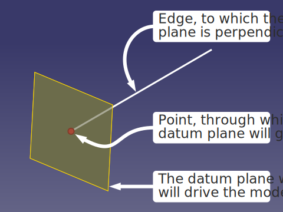

The 'front side' of the datum plane, on which a sketch is created, is sometimes counter intuitive, so it seems as if you need to draw a mirrorred sketch. To solve this, set the 'Map reversed' property of the datum plane to 'True'. It is best to do this early on in the process, since it often corrupts the sketch.

In this example, the **Skeleton** body contains a number of sketches:
* **sk front**: the front view of the housing 
* **sk separation**: the separation lines for both the top and the bottom separations
* **sk top**: the top view of the housing
* **sk rim trj**: the trajectory that the rim and the groove must follow
* **sk rim crs**: the cross sections of both the rim and the groove

Besides, it also contains a helper plane at the bottom of the separation that is used for the trajectory of the rim. The sketches also refer to each other: for instance, the length of the housing is both defined in **sk front** and in **sk bottom**. Therefore, **sk bottom** refers to **sk front** to obtain the length so the length is defined only once.

  

For instance, **sk front** looks like this:

  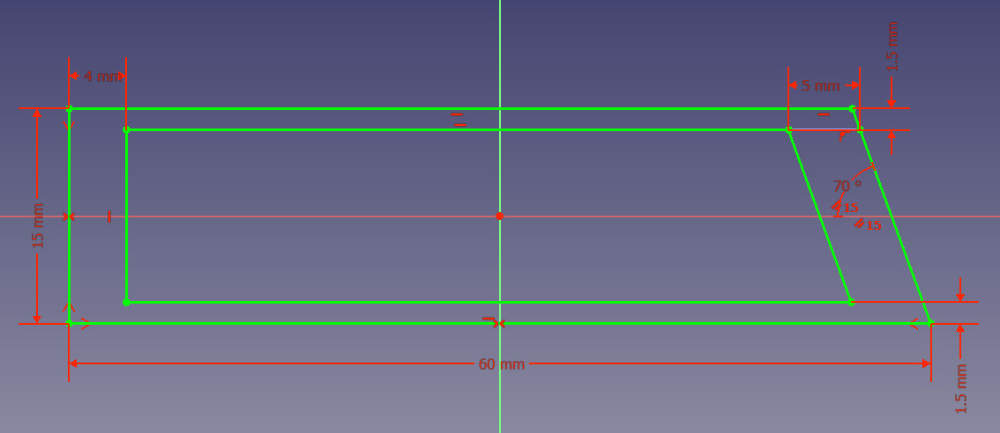

In **sk top**, the width of the outer body and the width of the cavity are defined, but all other dimensions are derived from the **sk front** sketch or the **sk separation** sketch:

  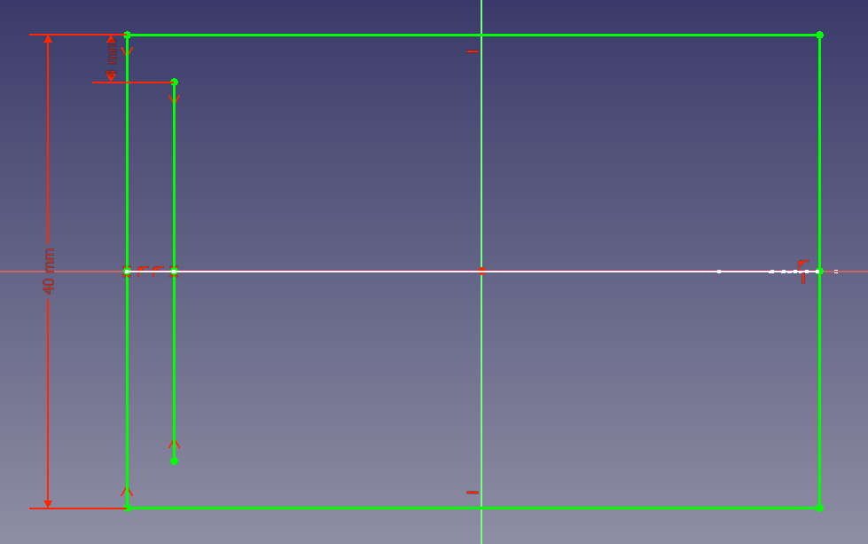

Now create a second body with the name **Housing**. It is not possible to create links to sketches in other bodies like we are used to. We first need to create a *Shape binder*:
1. Ensure that **Housing** is the active body
2. Select the **sk front** sketch in the **Skeleton** body
3. Use the `Create a sub-object(s) shape binder`-button on the toolbar to create a shape binder
4. Rename the shape binder **hs ref front**
5. Repeat these steps for **sk top**

Use elements from **hs ref top** to define four datum planes, from left to right:
1. **hs pln outside left**, that will be used for the sketch of the outer shape
2. **hs pln inside left**, for the shape of the cavity
3. **hs pln inside right** that is used as an end plane for the inner cavity
4. **hs pln outside right** that is used as an end plane for the housing

  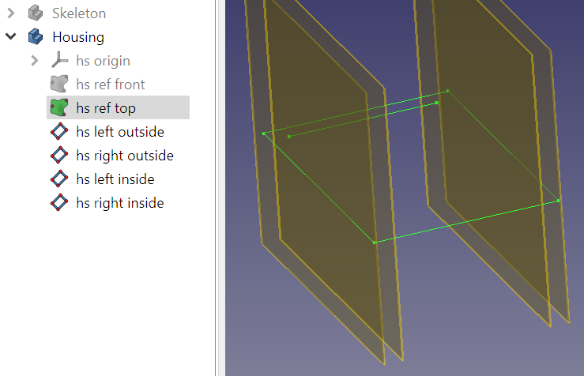

Use the **hs pln left outside** plane to draw **hs base** that defines the left side of the housing. **hs base** retrieves the shape from **hs ref front**.

Use **hs pln left inside** to draw the **hs cavity** sketch. This is extruded as **HS Cavity** until **hs pln inside right** to create **HS Cavity**

  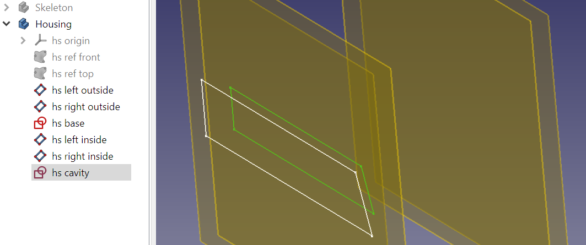

**hs base** is extruded until **hs pln outside right** to form **HS Base**.
Chamfers and fillets are added to the outside of the housing.
**hs cavity** is extruded until **hs pln inside right** to create **HS Cavity**,

  

Note that:
* the main outer dimensions of the housing can be changed by only changing dimensions in the **Skeleton** body
* not all sketches from the **Skeleton** body have been imported, e.g. the rim is not needed in the **Housing** body 
* details which are independent from other bodies (such as the chamfer), were only defined in the **Housing** body

The **Separation bottom** body is created in a similar way:

  

As goes for **Separation top**:

  

With boolean operations and refined shapes, both halves look like:

  

The proof of the pudding is in the eating. We change a few dimensions in the **sk front** sketch in the **Skeleton** body to see if the model is indeed parametric:

  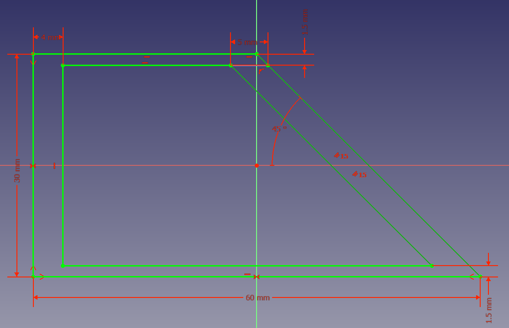

The result is as expected:

  

# Checking the model

## Using the Check geometry tool

The Check geometry tool from the part workbench can be used to check if the 3D model is valid (Part workbench > Part > Check geometry ). It is beyond the scope of this tutorial to explain how to solve common problems. MangoJelly has an [excellent video](https://www.youtube.com/watch?v=bw1Y5mrHrWY) on this tool. If causes are hard to find, the FreeCAD community is also willing to help out.

## Checking links

It can sometimes (although rarely) occur that links between bodies cause errors that are very hard to find. Sometimes the problem is that there are crosslinks between bodies, i.e. body A refers to body B and body B refers back to body A. This circular reference causes FreeCAD to stop automatic recalculation of the part.

The dependency graph (menu Tools > Dependency Graph) can be very helpful to spot those errors. To use this tool, the third party software [Graphviz](https://graphviz.org/) must be installed (see [https://wiki.freecad.org/Std_DependencyGraph](https://wiki.freecad.org/Std_DependencyGraph)).

The dependency graph of the housing looks like this (text balloons were added manually to improve readability):

The graph shows that:
* All bodies directly or indirectly refer to the **Skeleton** body 
* Body **Housing top** refers to **Separation top** and **Housing**
* References made by the **Part workbench** act on bodies, while references made by the **Part design workbench** act on features
* All arrows between the parts are black, indicating there are no errors in this graph

## Checking the result in the slicer

I'm using this technique often for 3D printing projects. One of the lessons I learned the hard way is that it is important to regularly check if the parts are printable.

Things to specifically pay attention to:
- are all details still large enough to print?
- would a different orientation of the separation plane make printing easier?
- is it possible to avoid support structures easily?
- is it possible to reduce print time by making other design choices?

  

As can be seen in this screenshot, both the top of the rim and the sides of the the groove are printale with multiple adjacent tracks. The dark blue lines indicate that the protrusion around the power connector is partially unsupported, but since these areas are very small, we will probably be fine.

# Creating references to the internal components of the housing

In the next example, we will build a housing for an internet of things application. The device will contain a thermometer/barometer/hygrometer connected to a microcontroller. The microcontroller can record the environmental conditions and report logged data over a wireless link.

For projects like this, it is important to obtain accurate 3D models. Usually they are available as STEP file or in another format which can be imported in FreeCAD.

Import the electronic components in the FreeCAD file and orient them well. In this project there is a risk that the heat of the wifi module of the microcontroller affects the temperature measurement of the sensor, so it is important to minimize thermal crosstalk when designing the housing.

  

Create the **Skeleton** body. In the skeleton, import important geometry of the components using shape binders. This way, the sketches in the skeleton will dynamically follow the components when the components are moved.

  

Create the sketches in the **Skeleton** body. 

  

Create the **Housing**, **Separation top**, **Separation bottom**, **Housing top** and **Housing bottom** like in the previous example.

  

  

We can now move the boards around, and (within certain limits), the cavities in the housing will follow the components.

# Using self tapping screws to close the housing

I often use self tapping screws for such housings. With the right tolerances, these screws work really well and require no post processing (tapping, inserts) in the parts, which makes it quite fast. These screws are available from many different suppliers at AliExpress.

  

In order to make the screw holes parametric, I created a model of the screw which contains an additional sketch representing the hole in the housing.

  

## Creating a screw hole
This is how it works:

Insert screw in the model using File > Merge project
1. Create a shape binder **hs ref screw hole 1** in the **Housing** body, referencing the screw hole sketch from the model of the screw (no need to make an intermediate reference in the **Skeleton** body)
2. Make the model of the original screw invisible (so we can only select elements fro the shape binder)
3. Select three points on the shape binder of the hole, and create a datum plane **hs pln screw hole 1** through these points

  

4. Create a sketch **hs screw hole 1** on this datum plane, tracing one half of the screw hole
5. Add a construction geometry line to this sketch, representing the centerline of the screw. I usually make the length equal to an arbitrary other line of the sketch to make the sketch fully defined.

  

6. Create a Groove **HS Screw hole 1** based on this sketch, choosing the construction line as a centerline.

  

Now if we move the screw to another location in x, y or z-direction, the shape binder **hs ref screw hole 1** and the datum plane **hs pln screw hole 1** will move with it, and thus the hole in the part will be fully parametric.

## Creating a pillar for the screw
Sometimes the seperation of the housing does not line up with the separation in the screw hole model. For instance, In the housing model I lined up the separation in the middle of the USB port, so the housing can be closed easily. 

To solve this, we can make a local pillar in the bottom housing and a hole in the top housing.

1. Create a shape binder **sk ref screw pillar 1** in the **Skeleton** body.
2. Make the model of the original screw invisible 
3. Create a datum plane **sk pln screw pillar 1** like we did in the housing
4. Create a sketch **sk screw pillar 1** that represents both the pillar in the **Bottom housing** and the hole in the **Top housing**. The top of the pillar must align with the separation plane in the screw hole, the bottom of the pillar is aligned with the lower line of the separation. Ensure the centerline of the pillar/hole is also a geometry line. We want to refer to it lateron.

  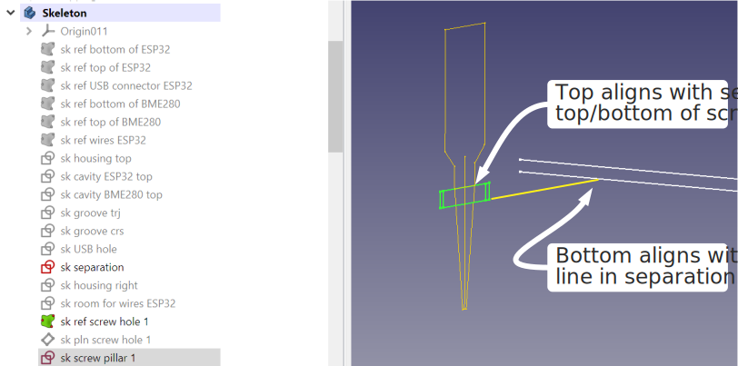

5. Make **Separation bottom** the active body
6. Create a shape binder of **sk screw pillar 1** from the **Skeleton** body and rename it **sb ref screw pillar 1**
7. Create a datum plane **sb pln screw pillar 1** like we did in the housing

  

8. Create a sketch **sb screw pillar 1** to create the pillar, and add a geometry line that will be the center line of the pillar

  

  In this case, I extended the bottom of the pillar so it would also fit the V-groove. Also, do not forget the centerline.

9.  Create a revolution and name it **SB Screw pillar 1** 
10. Repeat the same procedure for the other pillars. In this case, I did pillar 3 in the same way and created pillars 2 and 4 by mirroring.

  

Also repeat the procedure to create the holes in **Separation top**.

  

The changes will now automatically come through in both housing parts:

  

This is a good example to demonstrate why some changes need modifications in the housing part, while others require changes in the separation parts.

# Creating a complex hinge

The next project is a housing with a hinge. It can for instance be used for pencils or glasses. There is a magnet in each shell to keep the housing closed. An advantage of 3D printing is that we can pause printing at a designated layer to insert the magnets manually. When completed, the magnets are fully enveloped by the printed part.

This is the front view of the case when it is closed:

  

This is the front view of the case when it is open:

  

The details of the hinge are quite complex:

  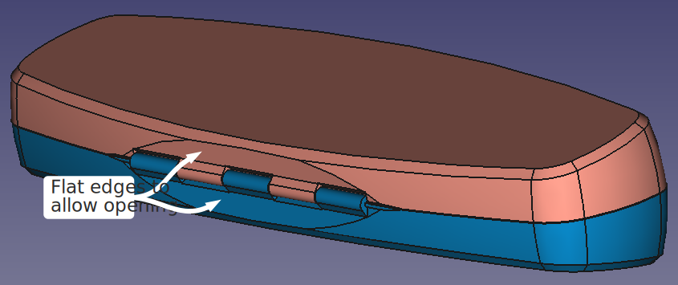

The flat edges in the rear view are needed to avoid mechanical interference when the case is fully open, and they act as an end stop.

This is a cross section through the middle of the casing when it is closed:

  

This is a cross section through the middle of the casing when it is open:

  

The orientation of the parts during printing is the same as when the case is open. To bridge the openings of the magnets well, the top of the magnet opening needs to be horizontal during printing. This is why the magnet opening is not rectangular.

Four sketches define the general shape of the housing, for the top view and the right view, and for the internal and the external shape:

  

Two sketches define the hinge:

  

For the design of a 3D printed hinge it is important to take into account the accuracy of printing. There needs to be a slit of about 0.3 mm between the parts in all directions.

**sk hinge right** defines the right view of the hinge. The smallest circle represents the hole for the hinge pin. The circle around that represents the cilindrical shape of the hinge. The outermost circle is a reference for the play between both parts of the housing.

  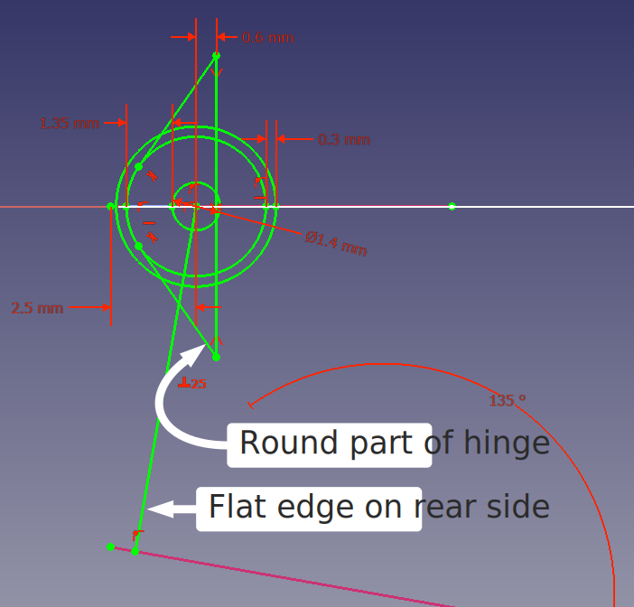

The line going down is perpendicular to the bottom flat side of the housing. This line is a reference for the flat face mentioned above.

There is also geometry representing the round parts of the hinge.

**sk hinge top** basically divides the length of the hinge in three parts:
* elements that are connected to the bottom part of the housing
* elements that are connected to the top part of the housing
* space between the parts (S)

The sketch contains only two dimensions: the total length of the hinge and the space between the parts. The radius of the cilinders is also modelled, but this has been derived from **sk hinge right**

  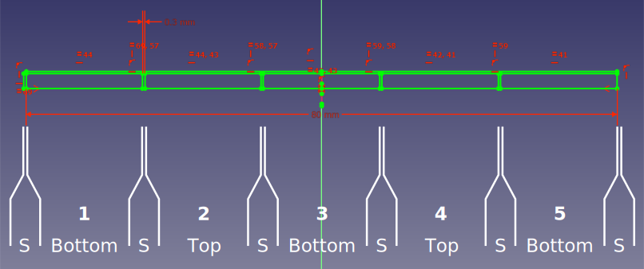

The housing is modelled in two different bodies: **Housing external** represents the outside of the housing, **Housing internal** represents the cavity inside. The final housing is obtained by boolean subtraction in the part workbench.

## Housing external

The relevant sketches from the skeleton are imported as shape binders. The bottom and top datum plane are defined as 'normal to edge', referencing the Z-axis and the bottom  and top most points. The contour **he base** is modelled on **he pln bottom** and extruded until **he pln top**.

  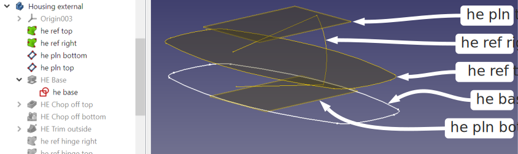

**he chop off top** chops off the oblique surfaces of **HE Base**.

  

A curve along the outside is made with a subtractive pipe using **he trim outside** along **he base**:

  

Chamfers are added, **he ref hinge right** is imported and the flat edges for the end stop when opening the case are created:

  

**he ref hinge top** is imported as shape binder, and the beginning- and end datum planes for the hinge are created. They exclude the space next to the hinge:

  

The cross section of the hinge **he hinge** is created on **he pln hinge left**, referring to **he ref hinge right** for the shape:

  

**he hinge** is extruded from **he pln hinge left** to **he pln hinge right**, forming HE Hinge:

  

As a final step for the hinge, the hole through the hinge is created:

  

Both sketches determining the magnet pockets are imported, two planes defining the beginning and end of the magnet pockets are created, the lower magnet pocket is created, and the upper magnet pocket is mirrored from the bottom one:

  

## Housing internal

The first steps of the Housing internal body are basically the same, but now referring to **sk housing internal top** and **sk housing internal right** instead of **sk housing external top** and **sk housing external right**:

  

**hi ref magnet cavity top** is imported as shape binder. A rounded rectangle is sketched with a wall thickness around this shape in **hi room for magnets**. This is extruded from the shape in both directions as **HI Room for magnets**:

  

Finally, a fillet is added to the magnet bump:

  

## Housing

The housing is created by boolean subtraction of **Housing external** and **Housing internal** in the Part workbench:

  

## Separation bottom

The **Separation bottom** body starts with importing **sb ref housing external top** and **sb ref housing external right**, and then construction only **sb pln bottom**. A rectangle is drawn in a plane 0.1 mm below the XY plane, to ensure there is 0.2 mm space between both shells when the housing is closed. The rectangle is 3 mm larger than the outer shape.

  

**sb ref hinge right** and **sb ref hinge top** are imported as shape binders. A positive revolve **SB Hinge positive volume** is added to the shape. The sketch **sb hinge positive volume** is a direct trace from **sb ref hinge top**.

  

  

Next we will create the slot for protrustion 2 from the top housing.

  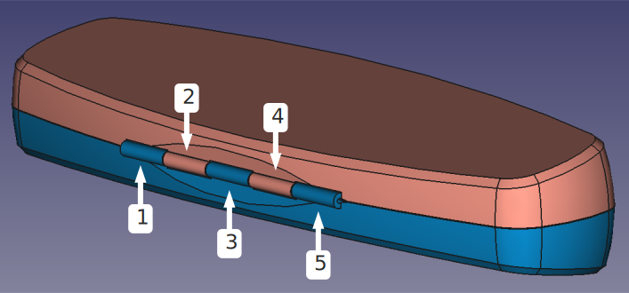

Two datum planes are created, **sb pln hinge slot 2 begin** and **sb pln hinge slot 2 end**, which will be used for the second slot. They will include the space next to the slot.

  

Sketch **sb hinge slot** on datum plane **sb pln hinge slot 2 begin** has a line that is parallel to the line in **sb ref hinge right**. This allows the top housing to be opened 180°, which is more than needed, ensuring sufficient space between both parts. The larger circle in **sb ref hinge right** is used, also to create space in radial direction.

  

**SB Hinge slot 2** is extruded until **sb pln hinge slot 2 end**:

  

**SB Hinge slot 4** is created by mirroring **SB Hinge slot 2** over the YZ plane.

  

## Housing bottom

**Housing bottom** is a boolean intersection of **Housing** and **Separation bottom**

  

## Separation top

**Separation top** is very similar to **Separation bottom**, only now the slots are in locations 1, 3 and 5. Slots 1 and 3 were created individually, slot 5 is a mirror of slot 1.

  

  

## Housing top

**Housing top** is a boolean intersection of **Housing** and **Separation top**

  

## Final checks

The dependency graph and check geometry tool that as described earlier reported no errors.

FreeCAD does not have a satisfactory tool to check for mechanical interferences.

An effective alternative is to draw a red colored block at a strategic location, and then do a boolean cut with both housing halves. By changing the location of the red block, different areas of the design can be inspected in detail. It is possible to keep the boolean results, so tests can be repeated later without too much overhead.

  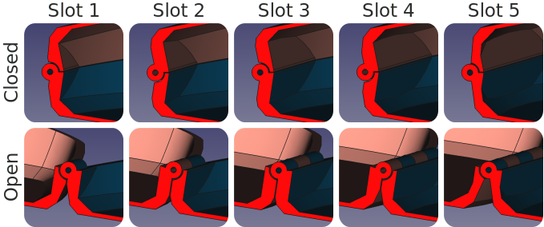

The printability inspection also looks good:

  

# Referencing external parts

