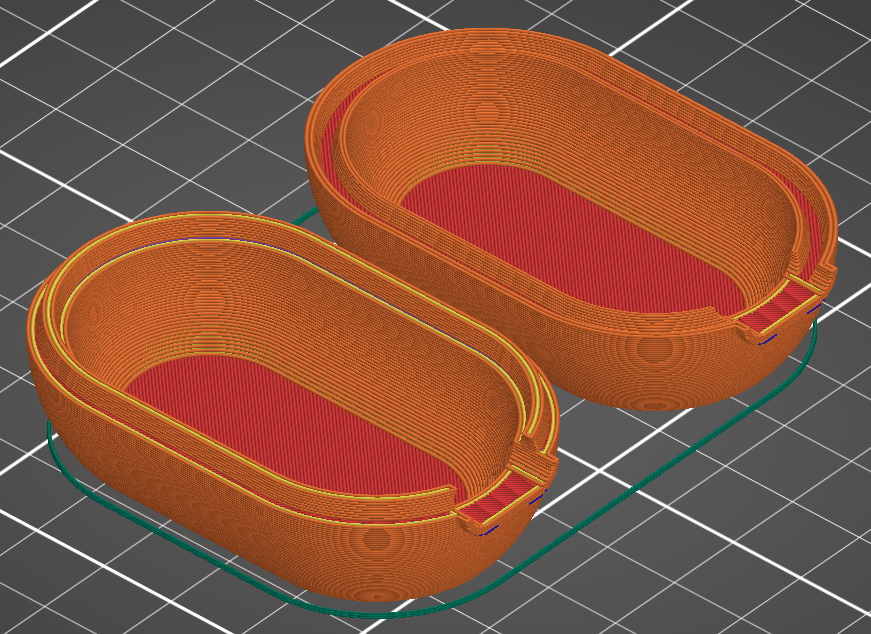

# Introduction
This tutorial I’ll demonstrate how to design 3D printable housings in FreeCAD. The advantage of this approach is that it is quite structured,
and you can manage changes in the design quite well, even if the design gets complex.

To follow this tutorial, you need to be familiar with the part design workbench and the sketcher. I’ll try to just focus on a high conceptal level.

# Topics in this document
- [Introduction](#introduction)
- [Topics in this document](#topics-in-this-document)
- [Concept of making a housing using boolean operation of bodies](#concept-of-making-a-housing-using-boolean-operation-of-bodies)
- [Making changes to the housing](#making-changes-to-the-housing)
- [Maintaining the colors of both housing bodies](#maintaining-the-colors-of-both-housing-bodies)
- [Checking the result in the slicer](#checking-the-result-in-the-slicer)
- [Using a skeleton to drive dimensions of the bodies](#using-a-skeleton-to-drive-dimensions-of-the-bodies)
- [Checking links between features using the dependency graph](#checking-links-between-features-using-the-dependency-graph)
- [Applying a naming convention for bodies and features](#applying-a-naming-convention-for-bodies-and-features)
- [Creating references to the internal components of the housing](#creating-references-to-the-internal-components-of-the-housing)
- [Using self tapping screws to close the housing](#using-self-tapping-screws-to-close-the-housing)
- [Creating a complex hinge](#creating-a-complex-hinge)
- [Creating references to external parts](#creating-references-to-external-parts)

# Concept of making a housing using boolean operation of bodies
I this example, we want to create a housing which consists of two shells which can be assembled together.
1. First create the housing (1) as a single body, without worrying about the separation.
2. Then create a second body (2) separation top, which covers which part of the housing will become the top half of the housing
3. Then create a bottom separation (3) as a third body in the same way
4. Then create the top housing as a boolean operation between the housing and the top separation
5. Then also create the bottom housing as a boolean operation between the housing and the bottom separation

Create the first body named **Housing** (1). In this example it consists of an additive loft for the outside and a subtractive loft for the internal cavity.

  

Then create another body in the same part, and call it **Separation top** (2). In this example, it consists of a pad and an additive pipe to create the rim. Note that the pad is deliberately larger than the housing: since we will create a boolean operation lateron, the exact size does not matter.

  

Also create **Separation bottom** (3) as a separate body.

  

Next move to the part workbench. Select **Housing** and **Separation top**, and choose the `Intersection` command from the toolbar.

  

Thus a new body named **Common** is created, consisting of the boolean intersection of both selected bodies. We rename that body **Housing top** (1 & 2).

It may seem as if the **Housing** body has disappeared from the model tree, so we can no longer select it to create the bottom housing. However, if we expand the **Housing top** body, we can see that **Housing** is still there since it was used to make up the **Housing top**. Select the **Housing** body and the **Separation bottom** body and apply the `Intersection` command again on those two bodies. The resulting body is named **Common 001**. Rename it to **Housing bottom** (1 & 3).

  

After modifying the color and transparency of both housing parts, the result looks like this:

  

# Making changes to the housing

One could argue that the drawback of this method is that we can no longer modify both **Housing top** and **Housing bottom** using the part design workbench. In practice this is not a problem, since we can make those modifications to the three bodies we started with. However, it is important to make a considerate decision about on which body to make the modification. For instance, if the housing is used to support some electronics, and we need a power cable to connect to the electronics inside, we can simply add those features to the original **Housing** body.

Ensure that **Housing** is the only visible body, and that it is the active part by doubleclicking it.

  

Next, add a protrusion and a hole to the housing for the power connector.

  

After making the **Housing** body invisible and the **Housing bottom** and **Housing top** bodies visible, we can see that both bodies were modified:

  

Please note that this operation has overwritten the colors of the **Housing bottom** and **Housing top** bodies. We can again correct these colors, but this soon becomes annoying and so we apply a simple workaround to avoid that.

# Maintaining the colors of both housing bodies

The simplest workaround is to create a copy of the bodies and apply the desired color to this copy.

Switch to the **Part workbench** and select the **Housing top** body.

  

Rename the copied body **Housing top refined** and modify color and transparency. Repeat this for **Housing bottom**.

  

The colors of the refined shapes will remain unchanged if the original bodies are modified.

Another advantage of this workaround is that we can create multiple copies in various positions. This way we can easily inspect the parts in different orientations by making the right combination visible.

  

# Checking the result in the slicer

Perhaps a little sidestep: I'm using this technique often for 3D printing projects. One of the lessons I learned the hard way is that it is important to regularly check if the parts are printable.

Things to specifically pay attention to:
- are all details still large enough to print?
- would a different orientation of the separation plane make printing easier?
- is it possible to avoid support structures easily?
- is it possible to reduce print time by making other design choices?

  

As can be seen in this screenshot, both the top of the rim and the sides of the the groove are printale with multiple adjacent tracks. The dark blue lines indicate that the protrusion around the power connector is partially unsupported, but since these areas are very small, we will probably be fine.

# Using a skeleton to drive dimensions of the bodies

As can be seen in this example, it would be helpful to create links between the different bodies to make the design truly parametric. For instance, the rim is defined in the **Separation top** and **Separation bottom** bodies, but they need to follow the contour that is defined in the **Housing** body. One body can reference another body, but the reference can only be in one direction: once features of a body B are referencing body A, there can no longer be a reference from body A to body B.

One way of keeping this structured is to start with a **Skeleton** body which only holds some basic shapes and dimensions, but that does not represent any volumes. This **Skeleton** body is then referenced by the other bodies.

Another advantage of a skeleton body is that it makes the model more robust. If sketches refer to 3D geometry, such as edges of the body, the model quickly becomes unstable since names of those edges are changed when making small changes (the notorious [Topological Naming Problem](https://wiki.freecad.org/Topological_naming_problem) ). When referring to edges in sketches instead, it is less likely that names of those edges are changed. This is especially true if we keep these sketches small and simple. It is therefore better to create a large number of simple sketches instead of a few complex ones.

In this example, the **Skeleton** body contains a number of sketches:
* **sk front**: the front view of the housing 
* **sk separation**: the separation lines for both the top and the bottom separations
* **sk bottom**: the bottom view of the housing
* **sk rim trj**: the trajectory that the rim and the groove must follow
* **sk rim crs**: the cross sections of both the rim and the groove

Besides, it also contains some helper planes that were used to create these sketches. The sketches also refer to each other: for instance, the length of the housing is both defined in **sk front** and in **sk bottom**. Therefore, **sk bottom** refers to **sk front** to obtain the length so the length is defined only once.

  

Now create a second body with the name **Housing**. It is not possible to create links to sketches in other bodies like we are used to. We first need to create a `sub-object shape binder`:
* Ensure that **Housing** is the active body
* Select the **sk front** sketch in the **Skeleton** body
* Use the `sub-object shape binder` button on the toolbar to create a shape binder
* Rename the shape binder **hs ref front** (I will explain the name convention later)

  

Repeat the procedure for **sk bottom** and rename is **hs ref bottom**. Now make the **Skeleton** body invisible using the spacebar. Then create a plane where the bottom sketch will be drawn:
1. Select the Z-axis of the **Housing** body in the model tree, 
2. Also select a point at the bottom of the housing in the model.

  

3. Now create a plane using the toolbar
4. Select 'normal to edge'in the Datum plane parameter window 

  

Now we have a plane that we can use for the bottom sketch. No create the bottom sketch of the housing bu simply tracing the **hs ref bottom** shape binder.

Repeat the same procedure with the top window. It is possible to reference the front edge of the right 

# Checking links between features using the dependency graph

# Applying a naming convention for bodies and features

# Creating references to the internal components of the housing

# Using self tapping screws to close the housing

# Creating a complex hinge

# Creating references to external parts
