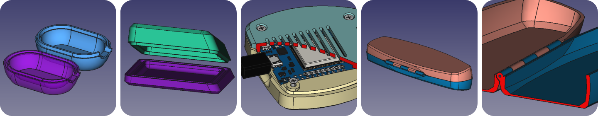

# Introduction
This tutorial demonstrates how to design 3D printable housings in FreeCAD. The advantage of the proposed approach is that it is quite structured, and changes to the design can be managed well, even if the design gets complex.

  

To follow this tutorial, you need to be familiar with the part design workbench and the sketcher. I’ll try to just focus on a high conceptual level.

1. [Concept of making a housing using boolean operation of bodies](./01-concept/Readme.md)
2. [Modifying the Housing Design](./02-making-modifications/Readme.md)
3. [Maintaining the colors of both housing bodies](./03-maintaining-colors/Readme.md)
4. [Applying a naming convention](./04-naming-convention/Readme.md)
5. [Using a skeleton to drive dimensions of the bodies](./05-skeleton-body/Readme.md)
6. [Checking the model](./06-check-model/Readme.md)
7. [Creating references to the internal components of the housing](./07-referencing-components/Readme.md)
8. [Using self tapping screws to close the housing](./08-self-tapping-screws/Readme.md)
9. [Creating a complex hinge](./09-hinge/Readme.md)
10. [Referencing external parts](./10-referencing-external-parts/Readme.md)

In [Chapter 1](./01-concept/Readme.md), the general concept is explained on how to setup the design of a housing using boolean operation of different bodies. [Chapter 2](./02-making-modifications/Readme.md) demonstrates that it is still quite manageable to make modifications to each body when setting up a design like this. [Chapter 3](./03-maintaining-colors/Readme.md) proposes a workaround for the fact that the colors of the parts are overwritten when making modifications to the design. [Chapter 4](./04-naming-convention/Readme.md) proposes a naming convention, so it remains easy to locate a feature when modifications are needed, even when designs become complex. [Chapter 5](./05-skeleton-body/Readme.md) explains the concept of using a skeleton body to manage links between different bodies of the model without the risk of circular references. Skeletons can also make the model more robust. [Chapter 6](./06-check-model/Readme.md) explains different ways to check if the model and the design are still valid. [Chapter 7](./07-referencing-components/Readme.md) extends the idea of the skeleton, but then using stock components as a resource to drive the model. [Chapter 8](./08-self-tapping-screws/Readme.md) proposes an elegant way to create holes for fasteners, and also a way to create pillars for screws if the hole does not line up with the separation line of the housing. [Chapter 9](./09-hinge/Readme.md) takes it a little bit further in using the same concept to create a quite complex hinge. Finally, [chapter 10](./10-referencing-external-parts/Readme.md) describes a method to split the design in multiple interlinked files, avoiding a very long model tree in a single file.

My first thought was to create a Youtube tutorial, but I decided would become quite long. A document is perhaps easier to speed up for the reader. A disadvantage of a document is that I will not learn how many views I have received. Please respond in the Issues section of Github if you appreciate this tutorial or if you have ideas for improvement.

HenkJan van der Pol

  

