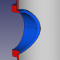

# Introduction
This tutorial demonstrates how to design 3D printable housings in FreeCAD. The advantage of the proposed approach is that it is quite structured, and changes to the design can be managed well, even if the design gets complex.

  

To follow this tutorial, you need to be familiar with the part design workbench and the sketcher. I’ll try to just focus on a high conceptual level.

This tutorial is divided in 10 chapters:

| <!--    --> | <!--  -->                                                                                                             |
|-------------|-----------------------------------------------------------------------------------------------------------------------|
|  | [1. Concept of making a housing using boolean operation of bodies](./01-concept/Readme.md)   Discusses the general concept on how to setup the design of a housing using boolean operation of different bodies. |
|  | [2. Modifying the Housing Design](./02-making-modifications/Readme.md)   Demonstrates that it is still quite manageable to make modifications to each body when setting up a design like this. |
|  | [3. Maintaining the colors of both housing bodies](./03-maintaining-colors/Readme.md)   Proposes a workaround for the fact that the colors of the parts are overwritten when making modifications to the design. |
|   | [4. Applying a naming convention](./04-naming-convention/Readme.md)   Proposes a naming convention, so it remains easy to locate a feature when modifications are needed, even when designs become complex. |
|  | [5. Using a skeleton to drive dimensions of the bodies](./05-skeleton-body/Readme.md)   Explains the concept of using a skeleton body to manage links between different bodies of the model without the risk of circular references.  Skeletons also make the model more robust. |
|  | [6. Checking the model](./06-check-model/Readme.md)   Different ways to check if the model and the design are still valid. |
|  | [7. Creating references to the internal components of the housing](./07-referencing-components/Readme.md)   Extends the idea of the skeleton, but then using stock components as a resource to drive the model. |
|  | [8. Using self tapping screws to close the housing](./08-self-tapping-screws/Readme.md)   Proposes an elegant way to create holes for fasteners, and also a way to create pillars for screws if the hole does not line up with the separation line of the housing. |
|  | [9. Creating a complex hinge](./09-hinge/Readme.md)   Takes it a little bit further in using the same concept to create a quite complex hinge.  |
|  | [10. Referencing external parts](./10-referencing-external-parts/Readme.md)   Describes a method to split the design in multiple interlinked files, avoiding a very long model tree in a single file.|

Please respond in the Issues section of Github if you appreciate this tutorial or if you have ideas for improvement.

This document is also availble as [pdf here](./Designing%20housings%20in%20FreeCAD.pdf)

HenkJan van der Pol

[Creative commons:](https://creativecommons.org/licenses/by-nc-sa/4.0/)

  

